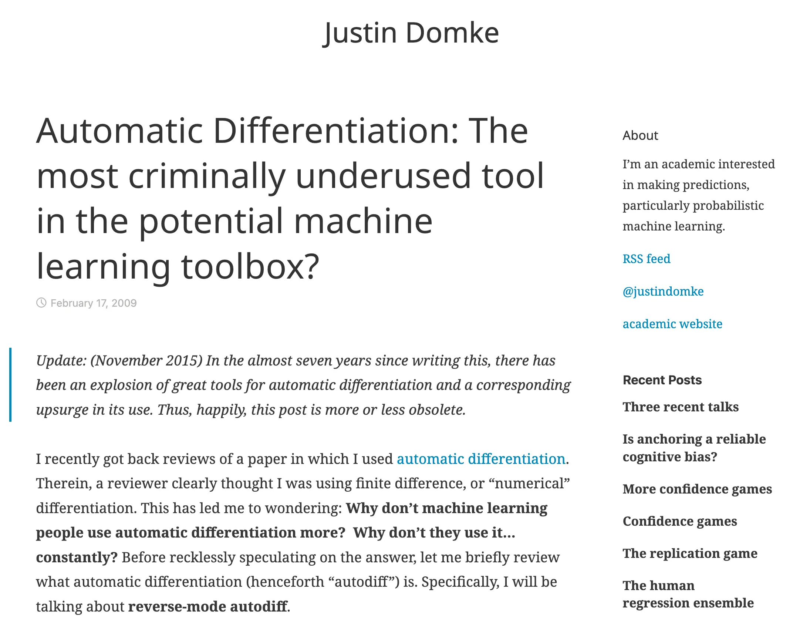
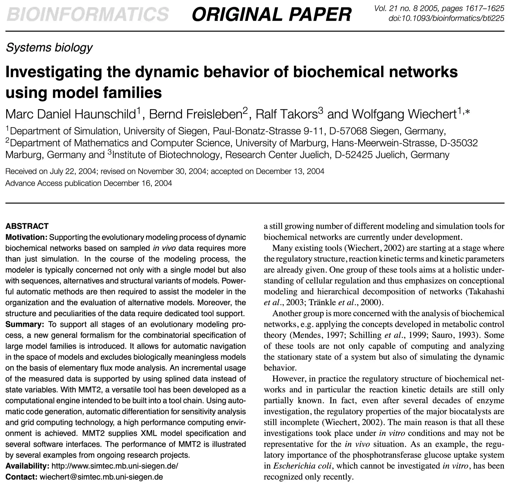
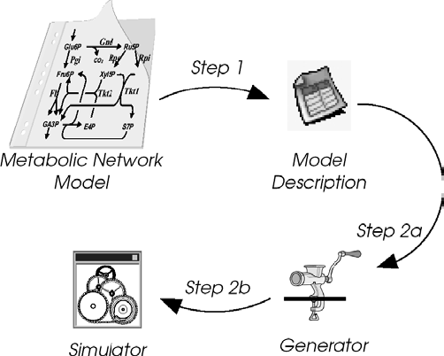
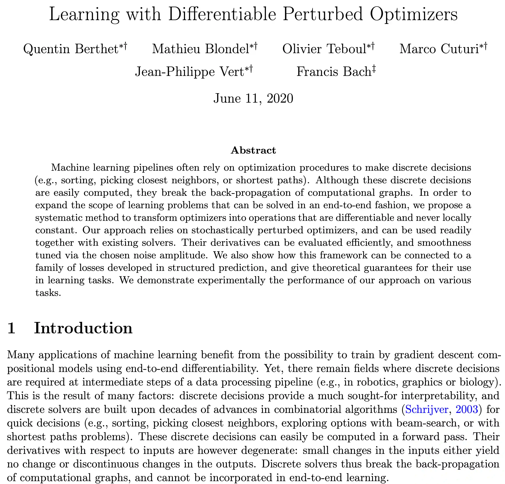

# Optimization and Gradients

## Optimization in Machine Learning

- Most ML problems involve finding parameters $\theta$ that minimize a loss function $L(\theta)$.
- How do we find the minimum?
- If $L$ is convex, we can follow the negative gradient $-\nabla L(\theta)$.

## The Role of Gradients

- The gradient $\nabla L(\theta)$ is a vector of partial derivatives:
  $$\nabla L(\theta) = \left[ \frac{\partial L}{\partial \theta_1}, \frac{\partial L}{\partial \theta_2}, \dots, \frac{\partial L}{\partial \theta_N} \right]$$
- It tells us the direction of steepest ascent.
- Moving in the opposite direction (gradient descent) helps us find local minima.

# The Curse of Dimensionality

## Growth of Parameter Space

- As the number of dimensions $N$ increases, the volume of the space increases exponentially.
- If we want to sample a 10-dimensional space with 10 points per dimension, we need $10^{10}$ points.
- Modern neural networks have millions or billions of parameters.

## Why Gradients Matter Here

- In high-dimensional spaces, "guessing" the right direction is impossible.
- Gradients provide a local "compass," pointing exactly where to go to decrease the loss.
- Without efficient gradients, deep learning would be computationally infeasible.

# Numerical Differencing

## Finite Differences

- The simplest way to approximate a derivative:
  $$f'(x) \approx \frac{f(x+h) - f(x)}{h}$$
- For a gradient in $N$ dimensions, we need to evaluate $f(x)$ at least $N+1$ times.

## Limitations of Finite Differences

1.  **Computational Cost:** $O(N)$ evaluations per gradient step. If $N=1,000,000$, this is too slow.
2.  **Accuracy:**
    - If $h$ is too large, the approximation is poor (truncation error).
    - If $h$ is too small, we hit floating-point precision limits (round-off error).
3.  **Stability:** Sensitive to noisy functions.

# Autodifferentiation (AD)

## Autodifferentiation Is Criminally Underused



## What is Autodifferentiation?

- It is **not** symbolic differentiation (like SymPy/Mathematica).
- It is **not** numerical differentiation (finite differences).
- AD decomposes a program into a sequence of elementary operations (addition, multiplication, exp, sin, etc.) and applies the chain rule to each.

## Symbolic vs. AD

- Symbolic differentiation can lead to "expression swell"—the resulting formula for the derivative can be much larger than the original function.
- AD keeps the computational cost proportional to the original function's evaluation.

## The Chain Rule

- If $y = g(u)$ and $u = f(x)$, then:
  $$\frac{dy}{dx} = \frac{dy}{du} \cdot \frac{du}{dx}$$
- AD automates this book-keeping across complex programs.

# Forward and Reverse Mode AD

## Forward Mode AD

- Computes the derivative "alongside" the function evaluation.
- We track $v$ and its derivative $\dot{v} = \frac{\partial v}{\partial x}$ for every intermediate variable.
- Efficient when the number of inputs $N$ is small compared to the number of outputs $M$ ($f: \mathbb{R}^N \to \mathbb{R}^M$).

## Reverse Mode AD

- Also known as **Backpropagation**.
- Requires two passes:
  1. **Forward Pass:** Compute and store all intermediate values.
  2. **Backward Pass:** Compute derivatives starting from the output and moving toward the inputs.
- Efficient when the number of outputs $M$ is small compared to the number of inputs $N$ (e.g., a single scalar loss function).

## Why Reverse Mode (Usually) Wins for ML

- In ML, we usually have:
  - Millions of parameters (Inputs).
  - One scalar loss value (Output).
- Reverse mode computes the *entire* gradient in roughly the same time it takes to evaluate the function once!

# AD in Practice: JAX

## What is JAX?

- A Python library for high-performance numerical computing.
- Developed by Google.
- "Numpy on steroids" with Autograd and JIT (Just-In-Time) compilation.

## Key JAX Transformations

- `jax.grad`: Computes the gradient of a function.
- `jax.jit`: Compiles functions for speed (using XLA).
- `jax.vmap`: Vectorizes functions (automatic batching).

## Coding Example: Rosenbrock Function

The Rosenbrock function is a classic optimization test case:
$$f(x, y) = (a-x)^2 + b(y-x^2)^2$$
Usually $a=1, b=100$. It has a global minimum at $(1, 1)$.

```python
import jax.numpy as jnp
from jax import grad, jit

def rosenbrock(params):
    x, y = params
    return (1.0 - x)**2 + 100.0 * (y - x**2)**2

# Compute the gradient function
grad_f = jit(grad(rosenbrock))

# Initial point
params = jnp.array([0.0, 0.0])

# One step of gradient descent
learning_rate = 0.001
for i in range(1000):
    grads = grad_f(params)
    params = params - learning_rate * grads

print(f"Final parameters: {params}")
print(f"Loss: {rosenbrock(params)}")
```

# AD Beyond ML: Flexible Scientific Computing

## Early Example: Haunschild et al.



::: {.notes}
- An early demonstration of AD applied to flexibly explore different computational models.
- By making the model differentiable, parameters can be fit without hand-deriving gradients.
:::

## Their Workflow



## Current Research: Making More Functions Differentiable



::: {.notes}
- A major focus of current research is extending differentiability to operations not traditionally considered smooth (sorting, argmax, rendering, simulation, etc.).
- This allows these operations to be embedded inside learned pipelines.
:::

## Summary

- Gradients are essential for high-dimensional optimization.
- Finite differences are too slow and inaccurate for large-scale ML.
- Autodifferentiation (specifically Reverse Mode) allows for efficient gradient computation.
- Tools like JAX make these techniques accessible and performant.

# Review Questions

1. Why is the curse of dimensionality a problem for optimization without gradients?
2. What are the two main types of error in numerical finite differences?
3. In what situation (input/output dimensions) is forward mode AD more efficient than reverse mode?
4. Why is reverse mode AD (backpropagation) the standard for training deep neural networks?
5. How does the computational cost of autodifferentiation compare to the cost of evaluating the original function?
