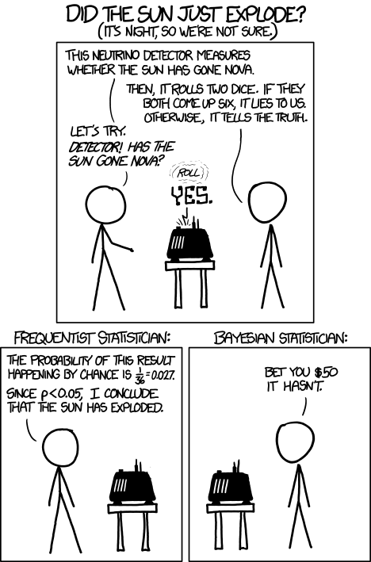
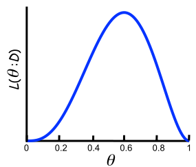
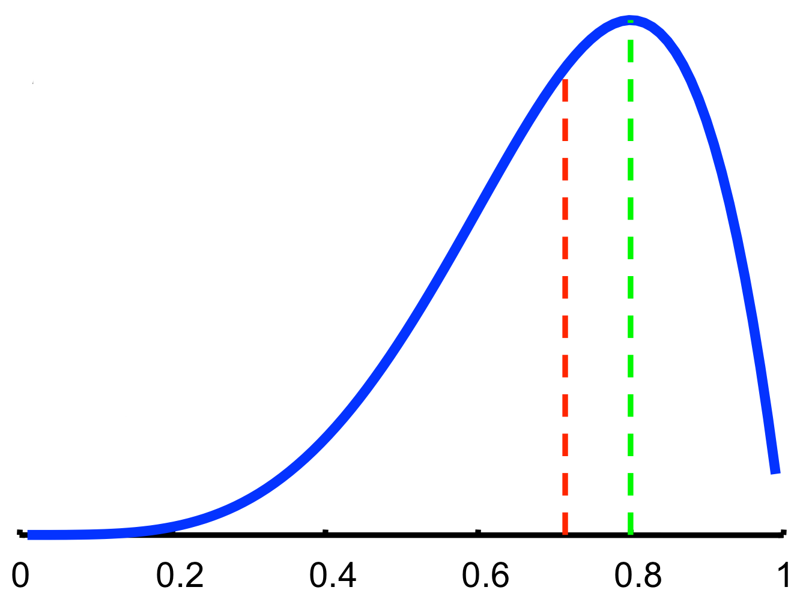

# Frequentist versus Bayesian

## Frequentist

- Data are a repeatable random sample (there is a frequency)
- Underlying parameters remain constant during repeatable process
- Parameters are fixed
- Prediction via the estimated parameter value

## Bayesian

- **Data are observed** from the realized sample
- Parameters are unknown and described probabilistically (random variables)
- **Data are fixed**
- Prediction is expectation over unknown parameters

::: {.notes}
- Go through the sample distribution process.
- Answers a different question!
:::

## Two views on how we interpret the world

{width=2in fig-alt="XKCD comic comparing frequentist and Bayesian statisticians. The frequentist concludes the sun exploded because the probability of the result happening by chance is low. The Bayesian bets it hasn't."}

## Bayesian statistics derivation

Bayes' theorem may be derived from the definition of conditional probability:
$$P(A\mid B)={\frac {P(B\mid A)\,P(A)}{P(B)}},\;\text{if}\; P(B)\neq 0$$
because
$$P(B\cap A) = P(A\cap B)$$
$$\Rightarrow P(A\cap B)=P(A\mid B)\,P(B)=P(B\mid A)\,P(A)$$
$$\Rightarrow P(A\mid B)={\frac {P(B\mid A)\,P(A)}{P(B)}},\;\text{if}\; P(B)\neq 0$$

::: {.notes}
- Older than frequentist statistics
- Nonconformist minister Thomas Bayes 1701-1761
- Left unpublished
- Posthumously recognized, edited, and published by Richard Price in 1770's
- Elected to Royal Society based on the work
- Philosophical extensions by Pierre-Simon Laplace
:::

## Classic example: Binomial experiment

- Given a sequence of coin tosses $x_1, x_2, \ldots, x_M$, we want to estimate the (unknown) probability of heads: $$P(H) = \theta$$
- The instances are independent and identically distributed samples

## Likelihood function

- How good is a particular parameter?
	- Answer: Depends on how likely it is to generate the data
$$L(\theta; D) = P(D\mid\theta) = \prod_m P(x_m \mid\theta)$$

- Example: Likelihood for the sequence: H, H, T, H, H
$$L(\theta; D) = \theta \theta (1-\theta)\theta\theta = \theta^4 (1-\theta)$$

{fig-alt="Plot of the likelihood function L(theta; D) = theta^4 * (1-theta) against theta. The curve peaks around theta = 0.8."}

::: {.notes}
- Frequentist: for a fixed parameter, model the data generation process.
:::

## Maximum Likelihood Estimate (MLE)

- Choose parameters that maximize the likelihood function
	- Commonly used estimator in statistics
	- Intuitively appealing
- In the binomial experiment, MLE for probability of heads: $$\hat{\theta} = \frac{N_H}{N_H + N_T}$$

## Is MLE the only option?

- Suppose that after 10 observations, MLE estimates the probability of a heads is 0.7.
	- Would you bet on heads for the next toss?
	- How certain are you that the true parameter value is 0.7?
	- Were there enough samples for you to be certain?

::: {.notes}
- Can look at sampling distribution of parameter.
- BUT: Let's say we get heads 5 times in a row. When are we ready to declare a coin biased?
- Frequentist alternative: bootstrapping — resample from observed data to estimate parameter uncertainty. But this does not incorporate prior knowledge.
- Bayesian approach: treat θ as a random variable with a prior distribution, updating beliefs as data arrives.
:::

## Bayesian approach
- Formulate knowledge about situation probabilistically
	- Define a model that expresses qualitative aspects of our knowledge (e.g., distributions, independence assumptions)
	- Specify a **prior** probability distribution for unknown parameters that expresses our beliefs
- Compute the **posterior** probability distribution for the parameters, given observed data
- The posterior distribution can be used for:
	- Reaching conclusions while accounting for uncertainty
	- Make predictions that account for our uncertainty

## Posterior distribution

- The posterior distribution combines the prior distribution with the likelihood function using Bayes' rule: $$P(\theta \mid D) = \frac{P(\theta) P(D\mid \theta)}{P(D)}$$
- The denominator is just a normalizing constant so you can simplify: $$\mathrm{Posterior} \propto \mathrm{Prior} \times \mathrm{Likelihood}$$
- Predictions can be made by integrating over the posterior: $$P(\mathrm{new data} \mid D) = \int_{\theta} P(\mathrm{new data} \mid \theta) P(\theta \mid D) \delta \theta$$

## Why does normalization matter?

- The denominator $P(D) = \int_\theta P(D \mid \theta)\, P(\theta)\, d\theta$ is the *marginal likelihood*
- It does not depend on $\theta$, so for *comparing* or *sampling* from the posterior it cancels out
- But to get a proper probability distribution (one that integrates to 1), we need it

**When can we skip it?**

- With a conjugate prior, the unnormalized posterior has a recognizable form—e.g., $\theta^4(1-\theta) \propto \text{Beta}(5, 2)$—so the normalizing constant is known analytically
- In all other cases, $P(D)$ requires a high-dimensional integral with no closed form, which is why MCMC and variational methods are needed

::: {.notes}
- A useful analogy: if you only need to know which of two options is more probable, you can compare unnormalized values. But if you need the actual probability—e.g., to make a calibrated prediction—you must normalize.
- The intractability of P(D) is the core computational challenge in Bayesian inference.
:::

## Maximum A Posteriori (MAP) Estimation

- Instead of integrating over the posterior, choose the parameter value that maximizes it:
$$\hat{\theta}_{MAP} = \arg\max_\theta P(\theta \mid D) = \arg\max_\theta P(D \mid \theta)\, P(\theta)$$
- With a **uniform prior**, MAP = MLE
- MAP is a **point estimate** — it does not capture parameter uncertainty
- Full Bayesian inference integrates over the posterior, propagating uncertainty to predictions

::: {.notes}
- MAP is the "compromise" between MLE and full Bayesian inference.
- Often used when a full posterior is computationally intractable but a prior is available.
- Taking the log of the MAP objective gives a penalized log-likelihood, which connects directly to regularization.
:::

## Credible Intervals vs. Confidence Intervals

- **Bayesian credible interval**: Given the data, there is a 95% probability the parameter lies in this range
	- A direct probability statement about the parameter value
- **Frequentist confidence interval**: If we repeated the experiment many times, 95% of such intervals would contain the true parameter
	- A statement about the *procedure*, not this specific interval

::: {.notes}
- Students routinely misinterpret confidence intervals as credible intervals — the Bayesian statement is the intuitive one.
- They can coincide numerically (e.g., with a flat prior), but are conceptually very different.
:::

## Revisiting the Binomial experiment

- Prior: $\theta \sim \text{Beta}(1, 1)$ (uniform on [0, 1])
- After observing 4 heads and 1 tail, the posterior is $\text{Beta}(5, 2)$:
$$P(\theta\mid x_1, \ldots ,x_M) \propto \theta^4(1-\theta)^1 \times 1 = \theta^4(1-\theta)$$
- The Bayesian predictive probability uses the posterior mean $E[\theta \mid D] = \frac{\alpha}{\alpha+\beta}$:
$$P(x_{M+1}=H\mid D) = \int_0^1\!\theta\, P(\theta\mid D)\, d\theta = \frac{5}{5+2} = \frac{5}{7} \approx 0.71$$
	- MLE estimate: $\hat\theta = \tfrac{4}{5} = 0.8$
	- Bayesian prediction: $P(x_{M+1}=H\mid D) = \tfrac{5}{7} \approx 0.71$

{fig-alt="Plot showing the posterior distribution (blue curve). A dashed green line marks the MLE estimate at 0.8, and a dashed red line marks the Bayesian prediction at approximately 0.71."}

## Bayesian inference and MLE

- The MLE and Bayesian prediction always differ in practice.
- However...
	- **If** prior is well-behaved (i.e., does not assign 0 density to any "feasible" parameter value)
	- **Then** both the MLE and Bayesian predictions converge to the same value as the training data becomes infinitely large

::: {.notes}
- Only gives same answer if our prior distribution is the same as the posterior.
:::

## Effect of data on the posterior

```{python}
#| echo: false
#| fig-alt: "Four Beta distribution curves showing the posterior of theta concentrating around the true value of 0.6 as the number of observations increases from 0 (flat prior) to 100 flips."
import numpy as np
import matplotlib.pyplot as plt
from scipy.stats import beta as beta_dist

theta = np.linspace(0, 1, 300)
stages = [
    (0,  0,  "Prior: Beta(1,1)"),
    (3,  2,  "5 flips (3H, 2T)"),
    (12, 8,  "20 flips (12H, 8T)"),
    (60, 40, "100 flips (60H, 40T)"),
]

fig, ax = plt.subplots(figsize=(7, 3.5))
for h, t, label in stages:
    ax.plot(theta, beta_dist.pdf(theta, 1 + h, 1 + t), label=label)
ax.axvline(0.6, color="black", linestyle="--", alpha=0.5, label="True θ = 0.6")
ax.set_xlabel("θ")
ax.set_ylabel("Density")
ax.set_title("Posterior concentrates around the true value with more data")
ax.legend(fontsize=8)
plt.tight_layout()
plt.show()
```

## Features of the Bayesian approach

- Probability is used to describe "physical" randomness and uncertainty regarding the true values of the parameters.
	- The prior and posterior probabilities represent degrees of belief, before and after seeing the data, respectively.
- The model and prior are chosen based on the knowledge of the problem and not, in theory, by the amount of data collected or the question we are interested in answering.

## How to choose a prior

- Objective priors: Noninformative priors that attempt to capture ignorance.
- Subjective priors: Priors that capture our beliefs as completely as possible. They are subjective but not arbitrary.
- Hierarchical priors: Multiple levels of priors.
- Empirical priors: Learn some of the parameters of the prior from the data ("Empirical Bayes")
	- Robust, able to overcome limitations of mis-specification of prior
	- Double counting of evidence / overfitting

## Beta Distribution

- A flexible distribution for probabilities $\theta \in [0, 1]$:
$$\text{Beta}(\theta \mid \alpha, \beta) \propto \theta^{\alpha-1}(1-\theta)^{\beta-1}$$
- $\alpha, \beta > 0$ are shape **hyperparameters**; the Uniform(0,1) is a special case: Beta(1, 1)
- Mean: $\dfrac{\alpha}{\alpha + \beta}$; Mode: $\dfrac{\alpha-1}{\alpha+\beta-2}$ (for $\alpha, \beta > 1$)

```{python}
#| echo: false
#| fig-alt: "Four Beta distribution curves with different alpha and beta parameters, illustrating shapes ranging from uniform to skewed to symmetric and peaked."
import numpy as np
import matplotlib.pyplot as plt
from scipy.stats import beta as beta_dist

theta = np.linspace(0.001, 0.999, 300)
params = [
    (1, 1, "Beta(1,1) — uniform"),
    (2, 5, "Beta(2,5) — skewed left"),
    (5, 2, "Beta(5,2) — skewed right"),
    (5, 5, "Beta(5,5) — symmetric, peaked"),
]
fig, ax = plt.subplots(figsize=(7, 3.5))
for a, b, label in params:
    ax.plot(theta, beta_dist.pdf(theta, a, b), label=label)
ax.set_xlabel("θ")
ax.set_ylabel("Density")
ax.legend(fontsize=8)
plt.tight_layout()
plt.show()
```

## Conjugate prior

- If the posterior distribution are in the same family as prior probability distribution, the prior and posterior are called conjugate distributions
- All members of the exponential family of distributions have conjugate priors


| **Likelihood**  | **Conjugate prior distribution**     | **Prior hyperparameter** | **Posterior hyperparameters**                 |
|-----------------|--------------------------------------|--------------------------|-----------------------------------------------|
| Bernoulli       | Beta                                 | $\alpha, \beta$          | $\alpha + \sum x_i, \beta + n - \sum x_i$     |
| Multinomial     | Dirichlet                            | $\alpha$                 | $\alpha + \sum x_i$                           |
| Poisson         | Gamma (shape $\alpha$, rate $\beta$) | $\alpha, \beta$          | $\alpha + \sum x_i,\; \beta + n$              |

::: {.notes}
- If we express a prior, observation with these, we will end up with a conjugate prior distribution out.
- For the Poisson/Gamma pair, the Gamma is parameterized as shape α and rate β, so the prior mean for the Poisson rate is α/β. The posterior mean is (α + Σxᵢ)/(β + n).
:::

## Computing the posterior distribution

Analytical integration
~ Works when "conjugate" prior distributions can be used, which combine nicely with the likelihood—usually not the case.

Gaussian approximation
~ Works well when there is sufficient data compared to model complexity—posterior distribution is close to Gaussian (Central Limit Theorem) and can be handled by finding its mode.

Markov chain Monte Carlo
~ Simulate a Markov chain that converges to the posterior—the Metropolis-Hastings algorithm proposes moves and accepts/rejects based on the posterior ratio. Currently the dominant approach for complex models.

Variational approximation
~ Cleverer way to approximate the posterior and maybe faster than MCMC but not as general and exact.

## Bayesian Interpretation of Regularization

- MAP estimation with a prior is equivalent to penalized likelihood optimization:
$$\hat{\theta}_{MAP} = \arg\max_\theta \underbrace{\log P(D \mid \theta)}_{\text{log-likelihood}} + \underbrace{\log P(\theta)}_{\text{log-prior (penalty)}}$$
- The choice of prior determines the regularizer:
	- **Gaussian prior** $P(\theta) \propto e^{-\lambda\|\theta\|^2}$ → **L2 / Ridge** regularization
	- **Laplace prior** $P(\theta) \propto e^{-\lambda\|\theta\|_1}$ → **L1 / Lasso** regularization (promotes sparsity)
- Regularization strength $\lambda$ corresponds to the precision (inverse variance) of the prior

::: {.notes}
- This reframes regularization as encoding a belief about parameters, not just a computational trick.
- Stronger regularization = more informative prior = less trust in the data alone.
:::

## Limitations and criticisms of Bayesian methods

- It is hard to come up with a prior (subjective) and the assumptions may be wrong
- Closed world assumption: need to consider all possible hypotheses for the data before observing the data
- Computationally demanding (compared to frequentist approach)
- Use of approximations weakens coherence argument

## When to use Bayesian vs. Frequentist methods

| Situation | Prefer Bayesian | Prefer Frequentist/MLE |
|-----------|----------------|------------------------|
| Sample size | Small | Large |
| Prior knowledge | Strong and defensible | Weak or absent |
| Goal | Uncertainty quantification, full posterior | Point estimates, hypothesis tests |
| Computation | Available | Constrained |
| Interpretability | Credible intervals, probability statements | p-values, confidence intervals |

::: {.notes}
- With large data, both converge — the practical question is cost vs. benefit.
- In biomedical settings, small samples and strong prior knowledge (from literature) often favor Bayesian methods.
:::

# Example: Diagnostic testing

A natural setting for Bayesian inference: updating beliefs about disease status given a test result.

Facts:

- Rapid home tests will pick up an HIV infection 97.7% of the time 28 days after exposure (sensitivity).
- These same tests have a specificity of 95%.
- 0.34% of the US population is estimated to be infected.

Questions:

- A US resident receives a positive test. What is the chance they have HIV?
- How would this change if 5% of the population were infected?

## Diagnostic testing: worked solution

Let $H$ = infected, $+$ = positive test. Applying Bayes' rule:
$$P(H \mid +) = \frac{P(+ \mid H)\, P(H)}{P(+)} = \frac{\text{sensitivity} \times \text{prevalence}}{\text{sensitivity} \times \text{prevalence} + (1-\text{specificity}) \times (1-\text{prevalence})}$$

**Case 1: prevalence = 0.34%**
$$P(H \mid +) = \frac{0.977 \times 0.0034}{0.977 \times 0.0034 + 0.05 \times 0.9966} = \frac{0.00332}{0.00332 + 0.04983} \approx 6.3\%$$

**Case 2: prevalence = 5%**
$$P(H \mid +) = \frac{0.977 \times 0.05}{0.977 \times 0.05 + 0.05 \times 0.95} = \frac{0.04885}{0.04885 + 0.04750} \approx 50.7\%$$

::: {.notes}
- The prior (prevalence) dominates when it is very small — even a good test produces mostly false positives in a low-prevalence population.
- This illustrates why screening programs in low-prevalence populations require confirmatory testing.
:::

# Reading & Resources

- 📖: [Bayesian Data Analysis](https://stat.columbia.edu/~gelman/books/)
- 📺: [Bayes theorem, the geometry of changing beliefs](https://www.youtube.com/watch?v=HZGCoVF3YvM)
- 📺: [The medical test paradox, and redesigning Bayes' rule](https://www.youtube.com/watch?v=lG4VkPoG3ko)
- 👂: [Linear Digressions: Beware of simple metrics](https://lineardigressions.com/episodes/2019/12/22/data-scientists-beware-of-simple-metrics)
- Software packages for Bayesian analysis:
	- [PyMC](https://github.com/pymc-devs/pymc) (python)
	- [emcee](https://github.com/dfm/emcee) (python)
	- [Stan](https://github.com/stan-dev/stan) (C++, python, R)

## Review Questions {.smaller}

1. What is a prior? How does one go about making one?
2. Can a prior be based on data? If so, how is this data related to the experiment being modeled (the observed)?
3. What are three differences between a Bayesian and maximum likelihood (frequentist) approach?
4. When will a Bayesian and maximum likelihood approach agree?
5. You are asked to provide up-to-date estimates of the 6-month failure rate for a stent going to market. A previous device had 3 devices out of 100 fails within 6 months, and you strongly suspect this device is similar. Provide the Bayesian estimate of the failure rate (i.e. $P(FR \vert N,m))$ given N devices have made it to 6 months, and m have failed. (Hint: Devices **either** pass or fail here. This follows a Binomial distribution with a Beta conjugate prior.)
6. What would be a reasonable estimate if you had no previous device's data?
7. What do you expect to happen to a posterior distribution as you add more and more data?
8. What does the integral $\int p(a \mid b)\, p(b \mid c)\, db$ give you? (This operation is called *marginalization*.) Why is this useful?
