# Dealing with many variables

- So far we've largely concentrated on cases in which we have relatively large numbers of measurements for a few variables
	- This is frequently referred to as $n > p$
- Two other extremes are important
	- Many observations and many variables
	- Many variables but few observations ($p > n$)

::: {.notes}
- Write out a big table of variables for people:
	- Age, HR, BP, Height, Weight, Income, Disposable income, Body fat %, 1 mile running time, Birth date, cholesterol level
- Ask for data reduction methods
:::

## Dealing with many variables

#### Usually when we're dealing with many variables, we don't have a great understanding of how they relate to each other

- E.g. if gene X is high, we can't be sure that will mean gene Y will be too
- If we had these relationships, we could reduce the data
	- E.g. if we had variables to tell us it's 3 pm in Los Angeles, we don't need one to say it's daytime

# Dimensionality Reduction

## Generate a low-dimensional encoding of a high-dimensional space

Purposes:

- Data compression / visualization
- Robustness to noise and uncertainty
- Potentially easier to interpret

Bonus: Many of the other methods from the class can be applied after dimensionality reduction with little or no adjustment!

::: {.notes}
- When we aren't using prediction, there won't be a clear benchmark for what is best.
- We will think about these methods both numerically and geometrically.
:::

## Matrix Factorization

*Many* dimensionality reduction methods involve matrix factorization

Basic Idea: Find two (or more) matrices whose product best approximate the original matrix

Low rank approximation to original $N\times M$ matrix:

$$ \mathbf{X} \approx \mathbf{W} \mathbf{H}^\top $$

where $\mathbf{W}$ is $N\times R$, $\mathbf{H}^\top$ is $M\times R$, and $R \ll N$.

::: {.notes}
- What is the implicit assumption here?
- So a values determine observation associations, b values determine variable associations.
- So we can think about these as row-wise, column-wise effects.

$$
\begin{bmatrix}
a_1  \\
a_2 \\
a_3
\end{bmatrix}
\begin{bmatrix} b_1 & b_2 & b_3 \end{bmatrix}
= 
\begin{bmatrix}
a_1b_1 & a_1b_2 & \ldots \\
a_2b_1 & & \\
a_3b_1 & \ldots & 
\end{bmatrix}
$$
:::

## Matrix Factorization

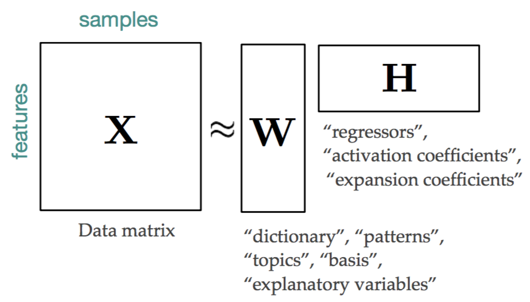{fig-alt="Diagram illustrating matrix factorization X approx W H^T, showing the dimensions of the original matrix X and the factor matrices W and H^T."}

Generalization of many methods (e.g., SVD, QR, CUR, Truncated SVD, etc.)

## Aside - What should R (rank) be?

$$ \mathbf{X} \approx \mathbf{W} \mathbf{H}^\top $$

where $\mathbf{W}$ is $M\times R$, $\mathbf{H}^\top$ is $M\times R$, and $R \ll N$.

::: {.notes}
- Reduced R simplifies the model substantially
- Also decreases fidelity of reconstruction
- Trade-off always
- Worst case, let's say N = M = R
	- $X \approx W H^T$
	- $N^2 \rightarrow N^2 + N^2$
	- Just doubled the number of values to track!
	- But can reconstruct perfectly. We could just make $W = I$ and $H = X^T$
- Most reduced:
	- $R = 1$
	- $X \approx w \otimes h$
	- $N^2 \rightarrow 2N$
	- Say $N=100$, we go from 10,000 to 200 values.
:::

## Matrix factorization is also compression

{width=80% fig-alt="Original image of a cat."}

## Matrix factorization is also compression

{width=80% fig-alt="Compressed image of the cat using 3 components, showing significant quality loss."}

## Matrix factorization is also compression

{width=80% fig-alt="Compressed image of the cat using 46 components, showing better quality reconstruction."}

::: {.notes}
- This is about 1% of the original data size.
- There is always information lost
- We just hope for it to be information that doesn't matter
- We have a good reason to believe the relevance of low dimensional structures
	- White noise has the highest entropy.
	- Adjacent pixels, edges, etc. indicates that the data points are sitting in a low dimensional subspace.
:::

# Examples

## Process control
- Large bioreactor runs may be recorded in a database, along with a variety of measurements from those runs
- We may be interested in how those different runs varied, and how each factor relates to one another
- Plotting a compressed version of that data can indicate when an anomalous change is present

## Mutational processes
- Anytime multiple contributory factors give rise to a phenomenon, matrix factorization can separate them out
- Will talk about this in greater detail

## Cell heterogeneity
- Enormous interest in understanding how cells are similar or different
- Answer to this can be in millions of different ways
- But cells often follow *programs*

# Principal Components Analysis

## Principal Components Analysis

For data table $\mathbf{X}$ with its singular value decomposition, $\mathbf{X} = \mathbf{U}\mathbf{D}\mathbf{V}^\top$, 

- $\mathbf{W} = \mathbf{U}\mathbf{D}$ as scores, observations in low-dimensional space
- $\mathbf{H} = \mathbf{V}$ as loadings, relationship between the features to their low-dimensional space
	- Each principal component (PC) is linear combination of **uncorrelated** attributes / features

## Principal Components Analysis

- Ordered in terms of variance
- $k$th PC is orthogonal to all previous PCs
- Reduce dimensionality while maintaining maximal variance
	- PCA minimizes reconstruction error: $\left\|\mathbf{X} - \mathbf{W}\mathbf{H}^\top\right\|^2_2$

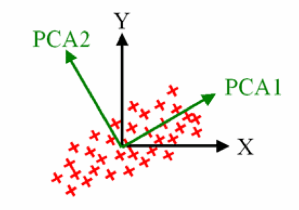{fig-alt="Scatter plot of data points with arrows indicating the directions of the first and second principal components (PC1 and PC2)."}

## Example: Principal Components Analysis

- Consider an example dataset of two variables about words
	- The number of lines of its dictionary definition
	- The length of a word
	- Example from Abidi & Williams, 2010
- We obtain $\mathbf{X}$ after applying appropriate centering and normalization

---

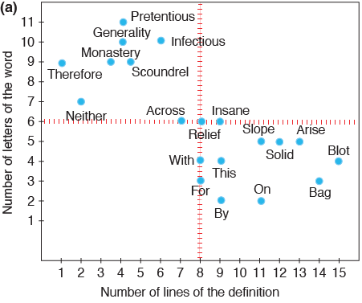{fig-alt=""}

---

- PCA identifies two orthogonal axes of variation
	- The first component (PC1) explains the most variation
	- The second component (PC2) is orthogonal to PC1

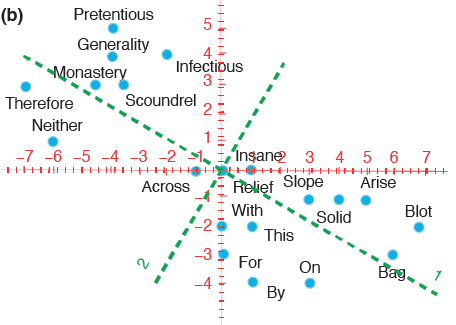{fig-alt=""}

---

- We can project the observed data points into components

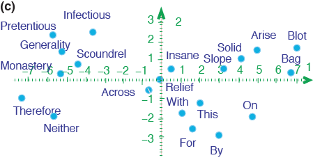{fig-alt=""}

---

- We can project the observed data points into components

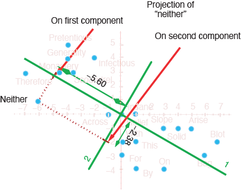{fig-alt=""}

::: {.notes}
- SVD: $\mathbf{X} = \mathbf{U}\mathbf{D}\mathbf{V}^\top$ 
- Scores: $\mathbf{W} = \mathbf{U}\mathbf{D}$
- Loadings: $\mathbf{H} = \mathbf{V}$
- Projection: $\mathbf{X}\mathbf{H} = \mathbf{U}\mathbf{D}\mathbf{V}^\top\mathbf{H} = \mathbf{U}\mathbf{D}\mathbf{H}^\top\mathbf{H} = \mathbf{U}\mathbf{D}\mathbf{I} = \mathbf{W}$
:::

## Principal Components Analysis

- Once you characterize PCA components, you may use the loadings to project new data points.

## Example: Principal Components Analysis

- Let's consider projecting a new word, 'sur'.

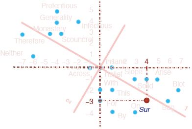{fig-alt=""}

::: {.notes}
- sur means 'on' in French
:::

---

- Let's consider projecting a new word, 'sur'.

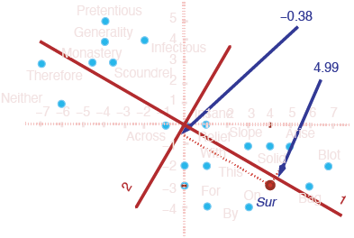{fig-alt=""}

::: {.notes}
- Go through example
- Mention normalization
- Construct scores and loadings plot
- Walk through interpretation of plots
- Go through selection of component numbers
- Talk about plotting higher components
- Talk about relationship going back to data from PCA
:::

## Methods to calculate PCA

- All methods are essentially deterministic
- Iterative computation
	- More robust with high numbers of variables
	- Slower to calculate
- NIPALS (Non-linear iterative partial least squares)
	- Able to efficiently calculate a few PCs at once
	- Breaks down for high numbers of variables (large p)

## Practical notes

- Implemented within `sklearn.decomposition.PCA`
	- `PCA.fit_transform(X)` fits the model to `X`, then provides the data in principal component space
	- `PCA.components_` provides the "loadings matrix", or directions of maximum variance
	- `PCA.explained_variance_` provides the amount of variance explained by each component

::: {.notes}
Go over explained variance.
:::

## Code example

~~~{.python code-line-numbers="11-12"}
import matplotlib.pyplot as plt
from sklearn import datasets
from sklearn.decomposition import PCA

iris = datasets.load_iris()

X = iris.data
y = iris.target
target_names = iris.target_names

pca = PCA(n_components=2)
X_r = pca.fit(X).transform(X)

# Print PC1 loadings
print(pca.components_[:, 0])

# Print PC1 scores
print(X_r[:, 0])

# Percentage of variance explained for each component
print(pca.explained_variance_ratio_)
# [ 0.92461621  0.05301557]
~~~

## Separating flower species

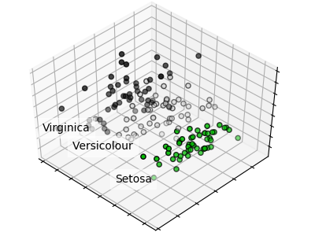{width=90% fig-alt="PCA plot of the Iris dataset, showing separation of the three flower species in the first two principal components."}

## Genes mirror geography within Europe

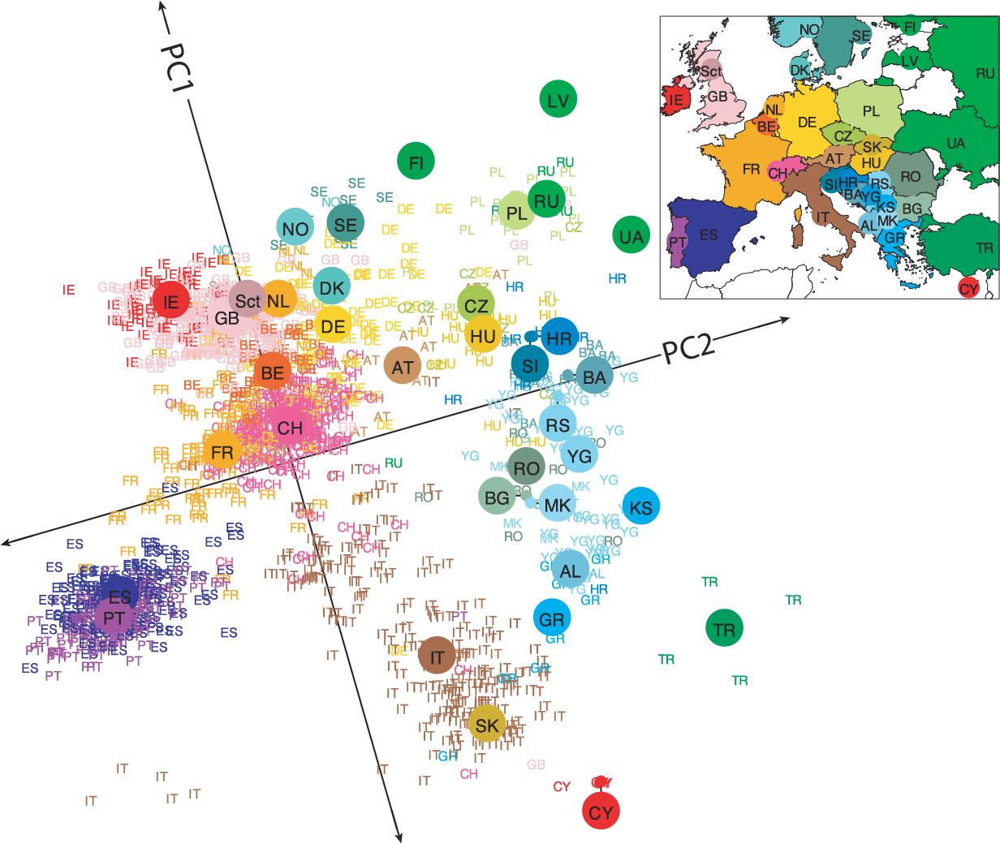{width=90% fig-alt="PCA plot from Novembre et al. 2008, showing population structure of 1,387 European individuals."}

::: {.notes}
- Talk about the population structure. Migration.
- Talk about the continuum of genetic ancestry.
:::

# Non-negative matrix factorization

What if we have data wherein effects always accumulate?

## Application: Mutational processes in cancer

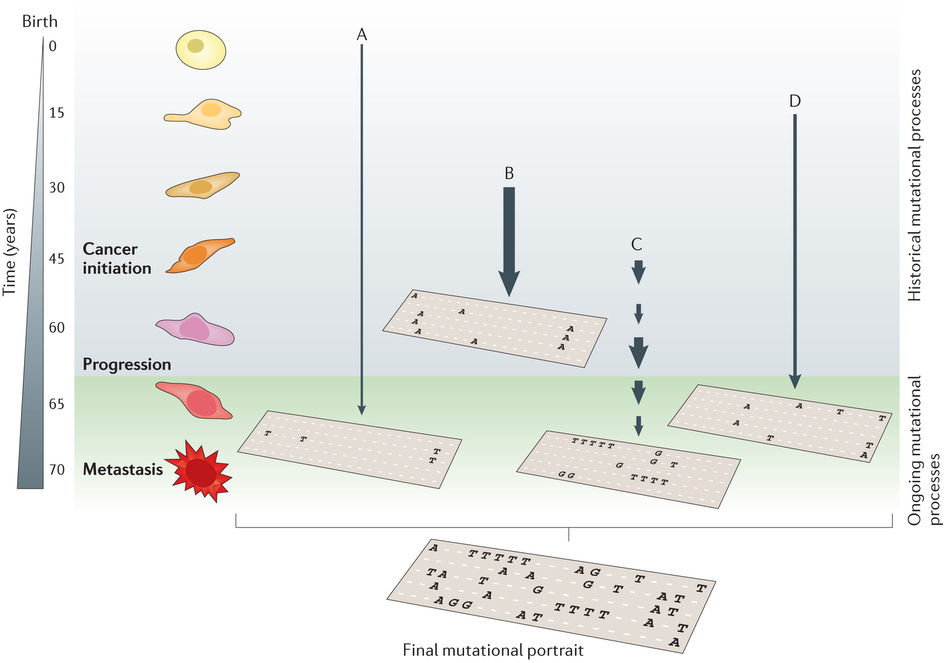{fig-alt="Diagram from Helleday et al (2014) illustrating mutational processes in cancer."}

--- 

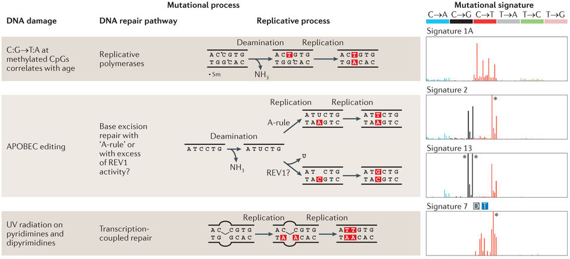{fig-alt="Diagram from Helleday et al (2014) illustrating mutational processes."}

--- 

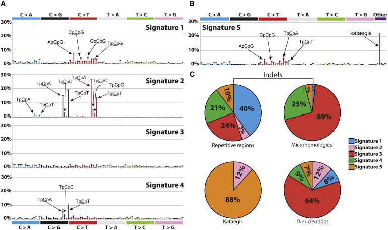{fig-alt="Figure from Alexandrov et al (2013) showing mutational signature A."}

--- 

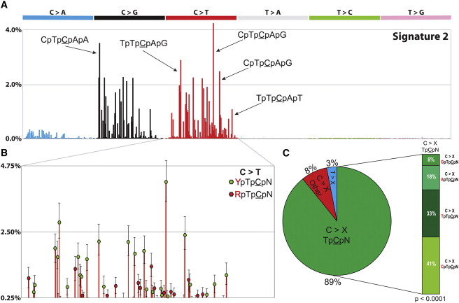{fig-alt="Figure from Alexandrov et al (2013) showing mutational signature B."}

::: {.notes}
- Also used in interpreting medical health records
:::

## Important considerations

- Like PCA, except the coefficients must be non-negative
- Forcing positive coefficients implies an additive combination of parts to reconstruct whole
- Leads to _sparse_ factors
- The answer you get will always depend on the error metric, starting point, and search method

## Multiplicative update algorithm

- The update rule is multiplicative instead of additive
- In the initial values for W and H are non-negative, then W and H can never become negative
- This guarantees a non-negative factorization
- Will converge to a local maxima
	- Therefore starting point matters

## Multiplicative update algorithm: Updating W

$$[W]_{ij} \leftarrow [W]_{ij} \frac{[\color{darkred} X \color{darkblue}{H^T} \color{black}]_{ij}}{[\color{darkred}{WH} \color{darkblue}{H^T} \color{black}]_{ij}}$$

Color indicates the [reconstruction of the data]{style="color:darkred;"} and the [projection matrix]{style="color:darkblue;"}.

## Multiplicative update algorithm: Updating H

$$[H]_{ij} \leftarrow [H]_{ij} \frac{[\color{darkblue}{W^T} \color{darkred}X \color{black}]_{ij}}{[\color{darkblue}{W^T} \color{darkred}{WH} \color{black}]_{ij}}$$

Color indicates the [reconstruction of the data]{style="color:darkred;"} and the [projection matrix]{style="color:darkblue;"}.

## Coordinate descent solving

- Another approach is to find the gradient across all the variables in the matrix
- Not going to go through implementation
- Will also converge to a local maxima

## Practical notes

- Implemented within `sklearn.decomposition.NMF`.
	- `n_components`: number of components
	- `init`: how to initialize the search
	- `solver`: 'cd' for coordinate descent, or 'mu' for multiplicative update
	- `l1_ratio`, `alpha_H`, `alpha_W`: Can regularize fit
- Provides:
	- `NMF.components_`: components x features matrix
	- Returns transformed data through `NMF.fit_transform()`

## Summary

#### PCA

- Preserves the covariation within a dataset
- Therefore mostly preserves axes of maximal variation
- Number of components will vary in practice

#### NMF

- Explains the dataset through two **non-negative** matrices
- Much more stable patterns when assumptions are appropriate
- Will explain less variance for a given number of components
- Excellent for separating out additive factors

## Closing

**As always, selection of the appropriate method depends upon the question being asked.**

# Reading & Resources

- 📺: [A visual linear algebra refresh](https://www.youtube.com/playlist?list=PLZHQObOWTQDPD3MizzM2xVFitgF8hE_ab)
- 📖: [Points of Significance: Principal Components Analysis](https://www.nature.com/articles/nmeth.4346)
- 📖: [Abdi and Williams. Principal component analysis](https://wires.onlinelibrary.wiley.com/doi/10.1002/wics.101)
- 📖: [Algorithms to calculate PCA models](https://learnche.org/pid/latent-variable-modelling/principal-component-analysis/algorithms-to-calculate-build-pca-models#lvm-pca-nipals-algorithm)
- 💾: [Principal Component Analysis Explained Visually](https://setosa.io/ev/principal-component-analysis/)
- 💾: [`sklearn.decomposition.PCA`](https://setosa.io/ev/principal-component-analysis/)
- 💾: [`sklearn.decomposition.NMF`](https://scikit-learn.org/stable/modules/generated/sklearn.decomposition.NMF.html)

## Review Questions

1. What do dimensionality reduction methods reduce? What is the tradeoff?
2. What are three benefits of dimensionality reduction?
3. Does matrix factorization have one answer? If not, what are two choices you could make?
4. What does principal components analysis aim to preserve?
5. What are the minimum and maximum number of principal components one can have for a dataset of 300 observations and 10 variables?

---

6. How can you determine the "right" number of PCs to use?
7. What is a loading matrix? What would be the dimensions of this matrix for the dataset in Q5 when using three PCs?
8. What is a scores matrix? What would be the dimensions of this matrix for the dataset in Q5 when using three PCs?
9. By definition, what is the direction of PC1?
10. [See question 5 on midterm W20](https://aarmey.github.io/ml-for-bioe/ex-midterm-files/20W.pdf). How does movement of the siControl EGF point represent changes in the original data?
