# Ordinary Differential Equations

- ODE models are typically most useful when we already have an idea of the system components
	- As opposed to *data-driven* approaches when we don't know how to connect the data
	- Incredibly powerful for making specific predictions about how a system works
- Limits of these approaches:
	- Results can be extremely sensitive to missing components or model errors
	- Can quickly explode in complexity
	- May rely on variables that are impossible to measure

::: {.notes}
- ODEs are extremely valuable
- During fitting, ML models are essentially a dynamic process — we will return to this at the end of the lecture and show that optimizers like Adam are coupled ODE systems
:::

# Applications of ODE models

## Molecular kinetics

Remember BE 110!

Let's say we have two ligands that dimerize, then this dimer binds to a receptor as one unit:

$$ L_f + L_f \leftrightarrow L_D $$

$$ L_D + R_f \leftrightarrow R_b $$

If we want to know about how these species interact, we can model their behavior with the rate equations:

BOARD

::: {.notes}
- $\frac{dL_f}{dt} = -k_1 L_f^2 + k_{-1}L_D$
- $\frac{dL_D}{dt} = k_1 L_f^2 - k_2 L_D R_f + k_{-2} R_b$
- $\frac{dR_b}{dt} = k_2 L_D R_f - k_{-2} R_b$
- $\frac{dR_f}{dt} = k_{-2} R_b - k_2 L_D R_f$
- What could we measure here?
	- How would that be implemented?
- Function-wise what do we need here?
:::

## Pharmacokinetics

```{mermaid}
flowchart LR
    drugInjection("drug injection") --> C1
    
    subgraph CentralCompartment["central compartment"]
        C1["C<sub>1</sub><br/>V<sub>1</sub>"]
    end
    
    subgraph PeripheralCompartment["peripheral compartment"]
        C2["C<sub>2</sub><br/>V<sub>2</sub>"]
    end
    
    C1 -->|k1| C2
    C2 -->|k2| C1
    C1 -->|ke| Elimination

    style CentralCompartment rect
    style PeripheralCompartment rect
```

::: {.notes}
- Copy to board
- What does each compartment represent?
- $V_1 \frac{dC_1}{dt} = -k_e C_1 V_1 - k_1 C_1 V_1 + k_2 C_2 V_2$
- $V_2 \frac{dC_2}{dt} = k_1 C_1 V_1 - k_2 C_2 V_2$
:::

## Applications of ODE models: Pharmacokinetics

- Central compartment corresponds to the plasma in the body.
	- $V_1$ is the distribution volume of plasma in the body.
	- $C_1$ is the concentration of drug in the plasma.
- Peripheral compartment represents a group of organs that significantly take up the particular drug.
	- $V_2$ is the volume of these group of organs.
	- $C_2$ is the concentration of drug in the group of organs.

## Applications of ODE models: Pharmacokinetics

- $k_e$ is the rate constant for clearance.
	- $k_e C_1 V_1$ is the mass of drug/time that's cleared.
- $k_1$ is the rate constant for mass transfer from the central to peripheral compartment.
	- $k_1 C_1 V_1$ is the mass of drug/time that transfers from the central to peripheral compartment.
- $k_2$ is the rate constant for mass transfer from the peripheral to central compartment.
	- $k_2 C_2 V_2$ is the mass of drug/time that transfers from the peripheral to the central compartment.

## Applications of ODE models: Pharmacokinetics

- Have a bolus i.v. injection
	- No drug in both compartments for $t<0$
	- Total dose $D$ (μg) administered at once at $t=0$
	- Drug distribution occurs instantaneously in the central compartment.
		- Also get well-mixed instantaneously.
		- Concentration in central compartment at $t=0$ is $C_1(0) = D/V_1$ μg/mL
- No chemical reactions in the compartment

::: {.notes}
Work out equations above. Going to learn a mathematical trick to solve!
:::

## Applications of ODE models: Population kinetics

#### Lotka-Volterra Equations

- Prey population $x$, predator population $y$:

$$\dot{x} = \alpha x - \beta x y$$

$$\dot{y} = \delta x y - \gamma y$$

- $\alpha$: prey birth rate; $\beta$: predation rate per encounter
- $\gamma$: predator death rate; $\delta$: predator growth per prey consumed

::: {.notes}
- Prey is x
- Predator is y
- $\dot{x} = \alpha x - \beta x y$
- $\dot{y} = \delta x y - \gamma y$
:::

# Types of Analysis

## Note about difference from other models we've covered

- ODE models can be part of inference techniques just as elsewhere
- But we often don't have a symbolic expression of the answer
	- Have to simulate the model every time
	- Can only focus on the input-output we get from the black box
- In this respect, what we do with ODE models will be very similar to what you could do with any computational simulation

::: {.notes}
- If we have a symbolic integral, then fitting an ODE model to data is just non-linear least squares
:::

## Analytic vs Numerical Modeling

### Analytic

- Wider range of parameters
- Avoid numerical problems
- Physical intuition more direct
- Often must simplify model

### Numerical

- Can handle complex models
- Dependence on parameters & initial conditions
- Physical insight may be difficult to extract
- Convergence, numerical stability

## Analytic vs Numerical Modeling

Reality often requires handling in between:

- Use analytic treatment to study entire parameter space
- Use numerical treatment to study interesting regions
- Use both to handle complex behavior

## Stability Analysis

- Can solve for steady-states of a system $$\frac{dF}{dt} = 0$$
- Results of this can be both stable or unstable points
	- With stable points, slope of $\frac{dF}{dt}$ is negative
	- In multivariate case, this means eigenvalues of Jacobian are negative
- Steady-state points aren't necessarily realistic or feasible!
	- NNLSQ can solve for points
	- Only simulating system ensures they are accessible

::: {.notes}
Walk through 1D case of stability.
:::

## Linear vs. Nonlinear Systems

- Linear models are easier to simulate and understand than non-linear
	- Linearity: If $\mathbf{x}_1$ and $\mathbf{x}_2$ are both solutions, then $c_1 \mathbf{x}_1 + c_2 \mathbf{x}_2$ is also a solution
- Linear systems tend to be separable (effective decoupling)
- Non-linear systems exhibit interesting properties

::: {.notes}
- Go through how linear systems come to a solution.
- $\frac{dx'}{dt} = c_1 x$
- What is this like if $c_1$ is negative? Positive? Imaginary?
- $e^{i\theta} = \cos \theta + i \sin \theta$
:::

## Linearity & Separability

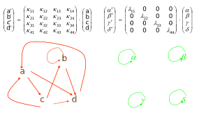{fig-alt="Linear separability and superposition principles in dynamical systems"}

::: {.notes}
- What is a Jacobian?
- What is steady-state here?
- Combined with above relationship, this means we can solve linear systems as a special case
:::

## Phase Portraits

$$
\dot{\vec{x}} = \vec{f}(\vec{x})
$$

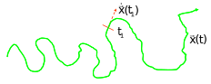{fig-alt="Phase portrait showing trajectories in a dynamical system"}

### Non-linear systems

- No general analytic approach to finding trajectory
- So, goal is to understand qualitative trajectory behavior

## Features in Phase Portraits

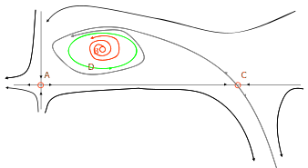{fig-alt="Features of phase portraits including fixed points and closed orbits"}

::: {.notes}
- Fixed Points (A, B, C). Steady states
- Closed Orbits (D). Periodic solutions
- Flow patterns in trajectory (A and C are similar to each other, different from B)
- Stability of fixed points and closed orbits (A, B, and C are unstable, D is stable)
:::

## Solving a Set of Equations for Phase Portrait

- Numerical computation
	- i.e., Runge-Kutta integration
- Qualitative
	- Sufficient for some purposes
- Analytic/symbolic
	- Elegant, though not always tractable

## Step 1: Find the fixed points

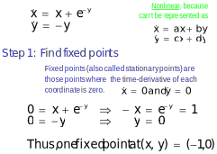{fig-alt="Identification of fixed points where derivatives are zero"}

## Step 2: Determine stability of fixed points

- If the systems moves slightly away from each fixed point, will it return or will it move further away?
- Another way to ask the same question is to ask whether, as time approaches infinity, does the system tend toward or away from a given stable point.
- Note $y$ solution must be of form:
	- $y = y_0 e^{-t}$ (because $\dot{y} = \frac{dy}{dt} = -y$)
	- So $y \rightarrow 0$ for $t \rightarrow \infty$
- Thus, $\dot{x} = x + e^{-y}$ becomes $\dot{x} \rightarrow x + 1$ for long times
	- This has exponentially growing solutions
	- Toward $\infty$ for $x > -1$ and $-\infty$ for $x < -1$

**Solution grows exponentially in at least one dimension, so it is unstable.**

## Step 3: Sketch nullclines

Nullclines are the sets of points for which $\dot{x} = 0$ or $\dot{y} = 0$, so flow is either horizontal or vertical.

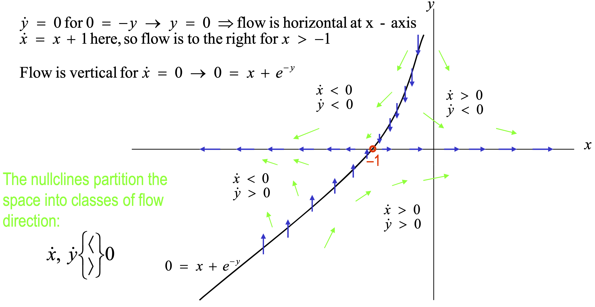{fig-alt="Nullclines separating regions of horizontal and vertical flow"}

## Step 4: Plot flow lines

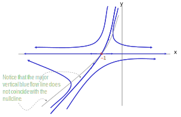{fig-alt="Flow lines indicating system trajectories and saddle point behavior"}

::: {.notes}
- Why do solutions partition the graph?
	- Uniqueness. To cross, you must be on the solution.
- This is a non-linear version of a saddle point.
- Can we identify saddle-like behavior in linearized version of system?
:::

## Existence & Uniqueness

Non-linear $\dot{\mathbf{x}} = f(\mathbf{x})$ and given an initial condition.

- Existence and uniqueness of solution guaranteed if $f$ is continuously differentiable
- Corollary: Trajectories **do not** intersect, because if they did, then there would be two solutions for the same initial condition at the crossing point

## Linearization About Fixed Points

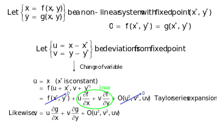{fig-alt="Linearization of a non-linear system around a fixed point"}

::: {.notes}
- Think of the Jacobian as the way to convert position to velocity.
:::

## Solving Linearized Systems

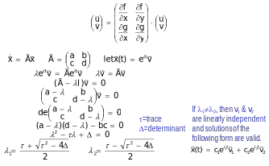{fig-alt="Eigenvalue analysis for solving linearized dynamical systems"}

::: {.notes}
- Third row is the definition of an eigenvalue.
- So if we move in $\vec{v}$ (remember that this is delta), $\vec{A}$ has the same effect as $\lambda I$.
- At stable point: $J \vec{x} = 0 = \dot{x}$
- Definition of an eigenvalue: $J x = \lambda x = \dot{x}$
	- Say this is positive?
	- Say this is negative?
:::

## Example

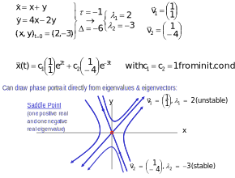{fig-alt="Example phase portrait of a linearized system"}

## More Examples

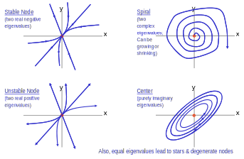{fig-alt="Various types of fixed points in phase portraits"}

## Classification of Fixed Points

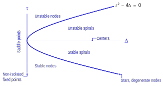{fig-alt="Classification of fixed points based on eigenvalue properties"}

## Eigenvalue Behavior Summary

| Eigenvalues | Fixed Point Type | Behavior |
|---|---|---|
| Real, both negative | Stable node | Trajectories converge to fixed point |
| Real, both positive | Unstable node | Trajectories diverge from fixed point |
| Real, opposite signs | Saddle point | Stable in one direction, unstable in another |
| Complex, negative real part | Stable spiral | Oscillatory decay toward fixed point |
| Complex, positive real part | Unstable spiral | Oscillatory divergence from fixed point |
| Purely imaginary | Center | Neutral closed orbits (undamped oscillation) |

## Relevance for Nonlinear Dynamics

- So, we have said that we can find fixed points of nonlinear dynamics, linearize about each fixed point, and characterize the dynamics about each fixed point in the non-linear model by the corresponding linear model.
- Is this always true? Do the nonlinearities ever disturb this approach?
- A theorem can be proven which states
	- That all the regions on the previous slide are “robust” (nodes, spirals, saddles) and correspond between linear and nonlinear models.
	- But that all the lines on the previous slide are “delicate” (centers, stars, degenerate nodes, non-isolated fixed points) and can have different behaviors in linear and non-linear models.

# Bifurcations

- The phase portraits we have been looking at describe the trajectory of the system for a given set of initial conditions. However, for “fixed” parameters (rate constants in eqns, for instance).
- What we might like is a series of phase portraits corresponding to different sets of parameters.
- **Many** will be qualitatively similar. The interesting ones will be where a small change of parameters creates a qualitative change in the phase portrait (bifurcations).
- What we will find is that fixed points & closed orbits can be created/destroyed and stabilized/destabilized.

## Saddle-Node Bifurcation

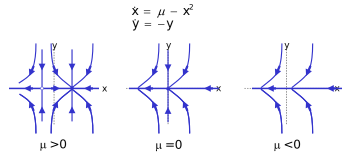{fig-alt="Diagram of a saddle-node bifurcation"}

- Canonical example: $\dot{x} = r + x^2$
  - For $r < 0$: two fixed points (one stable, one unstable)
  - At $r = 0$: the two fixed points collide and annihilate
  - For $r > 0$: no fixed points — system escapes to infinity

## Hopf Bifurcation

- A **Hopf bifurcation** occurs when a fixed point changes stability and a **limit cycle** (sustained oscillation) is born or destroyed
- Eigenvalues of $J$ cross the imaginary axis as a parameter varies
- Common in biological oscillators: circadian rhythms, cell cycle checkpoints, neural firing

::: {.notes}
- A stable limit cycle is born at a supercritical Hopf bifurcation
- An unstable limit cycle is born at a subcritical Hopf bifurcation — the system can then jump discontinuously to a distant attractor
:::

# Example: Genetic Control Network

## Genetic Control Network

The Griffith model is a canonical example of a **saddle-node bifurcation** giving rise to bistability — two coexisting stable steady states separated by an unstable one. Griffith (1971) model of genetic control:

- x = protein concentration
- y = mRNA concentration

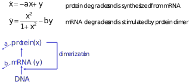{fig-alt="Griffith (1971) genetic control network model diagram"}

## Genetic Control Network

Biochemical version of a bistable switch:

1. Only stable points are no protein and mRNA or a fixed composition
2. If degradation rates too great, only stable point is origin

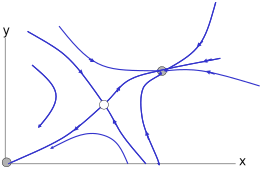{fig-alt="Phase portrait of a genetic control network acting as a bistable switch"}

::: {.notes}
- How could we compare this to data?
- Measure steady-state
- Start at points and see bifurcation
- Measure over time
:::

# Implementation

## Testing

- Many properties one can test
	- Mass balance
	- Changes upon parameter adjustment
- Good to test these before and after integration

::: {.notes}
Go through example of mass balance at deriv and solution.
:::

## Python Packages

SciPy provides several interfaces for ODE solving:

- [scipy.integrate.solve_ivp](https://docs.scipy.org/doc/scipy/reference/generated/scipy.integrate.solve_ivp.html) — **recommended modern interface**
- [scipy.integrate.odeint](https://docs.scipy.org/doc/scipy/reference/generated/scipy.integrate.odeint.html) — legacy, widely used in existing code
- [scipy.integrate.ode](https://docs.scipy.org/doc/scipy/reference/generated/scipy.integrate.ode.html) — low-level interface

Notes:

- All can solve stiff and non-stiff equations.
- `scipy.integrate.ode` exposes multiple backends; use `set_integrator` to select (e.g., `'vode'`, `'lsoda'`).
- `solve_ivp` uses the `method` argument instead (default `'RK45'`; use `'Radau'` or `'BDF'` for stiff systems).

## Code Example: Pendulum Oscillation

The second order differential equation for the angle $\theta$ of a pendulum acted on by gravity with friction can be written:

$$\theta''(t) + b*\theta'(t) + c*\sin(\theta(t)) = 0$$

where b and c are positive constants, and a prime (‘) denotes a derivative. To solve this equation with `odeint`, we must first convert it to a system of first order equations. By defining the angular velocity $\omega(t) = \theta'(t)$, we obtain the system:

$$\theta'(t) = \omega(t)$$

$$\omega'(t) = -b*\omega(t) - c*\sin(\theta(t))$$

## Pendulum Oscillation

Let y be the vector $[\theta, \omega]$. We implement this system in python as:

```python
def pend(y, t, b, c):
    theta, omega = y
    dydt = [omega, -b*omega - c*np.sin(theta)]
    return dydt
```

We assume the constants are $b = 0.25$ and $c = 5.0$:

```python
b, c = 0.25, 5.0
```

## Pendulum Oscillation

For initial conditions, we assume the pendulum is nearly vertical with $\theta(0) = \pi - 0.1$, and it initially at rest, so $\omega(0) = 0$. Then the vector of initial conditions is

```python
y0 = [np.pi - 0.1, 0.0]
```

We generate a solution 101 evenly spaced samples in the interval $0 \leq t \leq 10$. So our array of times is:

```python
t = np.linspace(0, 10, 101)
```

## Pendulum Oscillation

Call odeint to generate the solution. To pass the parameters b and c to `pend`, we give them to `odeint` using the `args` argument.

```python
from scipy.integrate import odeint
sol = odeint(pend, y0, t, args=(b, c))
```

The solution is an array with shape (101, 2). The first column is $\theta(t)$, and the second is $\omega(t)$. The following code plots both components.

## Pendulum Oscillation

```python
import matplotlib.pyplot as plt
plt.plot(t, sol[:, 0], 'b', label='theta(t)')
plt.plot(t, sol[:, 1], 'g', label='omega(t)')
plt.legend(loc='best')
plt.xlabel('t')
plt.grid()
plt.show()
```

## Pendulum Oscillation

```{python}
#| echo: false
#| fig-alt: "Plot of pendulum angle and angular velocity over time"
import numpy as np
import matplotlib.pyplot as plt
from scipy.integrate import odeint

def pend(y, t, b, c):
    theta, omega = y
    dydt = [omega, -b*omega - c*np.sin(theta)]
    return dydt

b, c = 0.25, 5.0
y0 = [np.pi - 0.1, 0.0]
t = np.linspace(0, 10, 101)
sol = odeint(pend, y0, t, args=(b, c))

plt.plot(t, sol[:, 0], 'b', label='theta(t)')
plt.plot(t, sol[:, 1], 'g', label='omega(t)')
plt.legend(loc='best')
plt.xlabel('t')
plt.grid()
plt.show()
```

## Analysis Example: The Cell Cycle

Consider a simple model of cells transitioning between two phases of the cell cycle:

```{mermaid}
graph LR
    G1[G1 Phase] -->|α| G2S[G2/S Phase]
	G2S -->|β| G1
    G1 -->|γ| Death[Death]
    G2S -->|γ| Death
    
    style G1 fill:#f9d5e5,stroke:#333,stroke-width:2px
    style G2S fill:#a1e7e6,stroke:#333,stroke-width:2px
    style Death fill:#f8b195,stroke:#333,stroke-width:2px
```

Can this model oscillate under physically meaningful situations and, if so, when?

::: {.notes}
$$\frac{dG1}{dt} = - \alpha [G1] + 2 \beta [G2] - \gamma [G1]$$

$$\frac{dG2}{dt} = \alpha [G1] - \beta [G2] - \gamma [G2]$$

$$J = 
\begin{pmatrix}
-\alpha - \gamma & 2\beta \\
\alpha & -\beta - \gamma \\
\end{pmatrix}
$$

$$\lambda = \frac{1}{2} \left( -\alpha -\beta -2 \gamma \pm \sqrt{\alpha^2 + 6 \alpha \beta + \beta ^2}  \right)$$

$\alpha$ and/or $\beta$ would have to be negative to oscillate.
:::

## Implementation Note: Stiff Systems

- Very roughly, most ODE solvers take steps inversely proportional to the rate at which the state is changing
- For systems where there are two processes operating on differing timescales, this can be problematic
	- If everything happens really fast, the system will come to equilibrium quickly
	- If everything is slow, you can take longer steps
- A typical biological example: receptor–ligand binding equilibrates in milliseconds, while downstream transcriptional responses occur over hours — a $10^6$-fold difference in timescale
- *Stiff* solvers additionally require the Jacobian matrix
	- This very roughly allows them to keep track of these differences in timescales
- `odeint` can automatically find this for you
	- Sometimes it's faster/better to provide this as parameter `Dfun`
- For stiff problems with `solve_ivp`, prefer `method='Radau'` or `method='BDF'`

## Fitting ODE Models to Data

- ODE models have no closed-form solution in general — must simulate to evaluate the likelihood
- Fitting is an **outer optimization loop** around numerical integration:

```python
from scipy.integrate import solve_ivp
from scipy.optimize import minimize

def residuals(params):
    sol = solve_ivp(model, t_span, y0, args=(params,), t_eval=t_obs)
    return np.sum((sol.y.T - y_obs)**2)

result = minimize(residuals, params_init)
```

- Can constrain to oscillatory solutions by checking eigenvalues of $J$ at steady state
	- Oscillation requires eigenvalues with nonzero imaginary part

# Machine Learning as a Dynamical System

```{python}
#| include: false
import numpy as np
import matplotlib.pyplot as plt
import matplotlib.gridspec as gridspec

plt.rcParams.update({
    "font.family": "sans-serif",
    "font.size": 11,
    "axes.titlesize": 12,
    "axes.labelsize": 11,
    "axes.spines.top": False,
    "axes.spines.right": False,
})

COLORS = {
    "stable":      "#2ecc71",
    "oscillatory": "#3498db",
    "diverging":   "#e74c3c",
}
```

## Optimization as a Discrete-Time ODE

- Every iterative ML optimizer is a **discrete-time dynamical system**
  - State vector: model parameters $\theta_t$ (and, for adaptive optimizers, auxiliary moment estimates)
  - Update rule: $\theta_{t+1} = \theta_t - \eta \, g_t$ (analogue of an Euler integration step)
- The **learning rate** $\eta$ plays the role of the integration step size
  - Too small: slow convergence (fine-grained but inefficient)
  - Too large: oscillation or divergence — exactly as in stiff ODE solvers

::: {.notes}
- Gradient descent with step size η on L(θ) = θ²/2 gives θ_{t+1} = (1−η)θ_t
- This is a linear map with discrete eigenvalue λ = 1−η
- |λ| < 1 ↔ convergence; λ < 0 ↔ sign-alternating (oscillatory)
- The stability condition 0 < η < 2/L (L = Lipschitz constant of gradient) mirrors the ODE condition that all eigenvalues have negative real part
:::

## Stability Analysis of Gradient Descent

For a quadratic loss $L(\theta) = \frac{1}{2}\theta^T H \theta$, the gradient descent update is:

$$\theta_{t+1} = (I - \eta H)\,\theta_t$$

The discrete eigenvalues are $\lambda_i = 1 - \eta h_i$, where $h_i$ are eigenvalues of the Hessian $H$.

| Eigenvalue $\lambda_i$ | Fixed-Point Type | Behavior |
|---|---|---|
| $0 < \lambda < 1$ | Stable node | Monotone convergence |
| $-1 < \lambda < 0$ | Stable spiral | Oscillatory convergence |
| $\lambda < -1$ | Unstable | Divergence |
| $\lambda = 0$ | Dead-beat | Converges in one step |

## Stability Analysis of Gradient Descent

**Stability requires** $0 < \eta < \frac{2}{h_\text{max}}$ — controlled entirely by the largest Hessian eigenvalue.

```{python}
#| echo: false
#| fig-alt: "Three regimes of gradient descent for different learning rates: monotone convergence, oscillatory convergence, and divergence"
fig, axes = plt.subplots(1, 3, figsize=(11, 3.8))

configs = [
    (0.3,  30, "stable",      r"$\eta = 0.3$" + "\nMonotone convergence",    r"$\lambda = 0.7$"),
    (1.5,  30, "oscillatory", r"$\eta = 1.5$" + "\nOscillatory convergence",  r"$\lambda = -0.5$"),
    (2.2,  15, "diverging",   r"$\eta = 2.2$" + "\nDivergence",               r"$\lambda = -1.2$"),
]
theta0 = 1.8
for ax, (eta, n, key, title, lam_str) in zip(axes, configs):
    thetas = [theta0]
    for _ in range(n):
        thetas.append((1 - eta) * thetas[-1])
        if abs(thetas[-1]) > 8:
            break
    thetas = np.array(thetas)
    color = COLORS[key]
    ax.plot(range(len(thetas)), thetas, "o-", color=color, markersize=5,
            linewidth=2, markerfacecolor="white", markeredgewidth=1.8)
    ax.axhline(0, color="black", linestyle="--", linewidth=1, alpha=0.4)
    ax.set_title(title, pad=8)
    ax.set_xlabel("Iteration $t$")
    ax.set_xlim(-0.5, n + 0.5)
    ax.text(0.97, 0.97, lam_str, transform=ax.transAxes, ha="right", va="top",
            fontsize=10, bbox=dict(boxstyle="round,pad=0.3", facecolor="white",
                                   edgecolor=color, linewidth=1.5))

axes[0].set_ylabel(r"$\theta$ (parameter value)")

ins = axes[0].inset_axes([0.55, 0.45, 0.42, 0.42])
th = np.linspace(-2, 2, 200)
ins.plot(th, th**2 / 2, color="gray", linewidth=1.5)
ins.set_title(r"$L(\theta)=\frac{\theta^2}{2}$", fontsize=8, pad=2)
ins.set_xticks([]); ins.set_yticks([])

fig.suptitle("Learning Rate Governs Stability of Gradient Descent",
             fontsize=13, fontweight="bold", y=1.01)
plt.tight_layout()
plt.show()
```

## The Condition Number Problem

- Realistic loss surfaces have Hessian eigenvalues spanning many orders of magnitude (ill-conditioned)
- For $L(\theta) = \frac{a}{2}\theta_1^2 + \frac{b}{2}\theta_2^2$ with $a \gg b$:
  - Stability requires $\eta < 2/a$ — set by the **stiff** direction
  - The slow direction $\theta_2$ then requires $\sim \frac{a}{b}$ more steps to converge

## The Condition Number Problem

- This is precisely the **stiff ODE** problem: fast and slow timescales coexist
  - Just as stiff ODE solvers need the Jacobian, adaptive optimizers track local curvature

```{python}
#| echo: false
#| fig-alt: "Phase portraits of gradient descent on an ill-conditioned quadratic loss showing monotone, oscillatory, and diverging trajectories"
a, b = 8.0, 1.0

th1 = np.linspace(-2.5, 2.5, 300)
th2 = np.linspace(-2.5, 2.5, 300)
T1, T2 = np.meshgrid(th1, th2)
L = (a / 2) * T1**2 + (b / 2) * T2**2

fig, axes = plt.subplots(1, 3, figsize=(12, 4.2))

phase_configs = [
    (0.08, [2.0, 2.0], "stable",      r"$\eta = 0.08$" + "\n(monotone, slow)"),
    (0.18, [2.0, 2.0], "oscillatory", r"$\eta = 0.18$" + "\n(oscillatory convergence)"),
    (0.28, [2.0, 2.0], "diverging",   r"$\eta = 0.28$" + "\n(divergence)"),
]

for ax, (eta, t0, key, title) in zip(axes, phase_configs):
    traj = [np.array(t0, dtype=float)]
    for _ in range(40):
        t = traj[-1]
        traj.append(t - eta * np.array([a * t[0], b * t[1]]))
        if np.linalg.norm(traj[-1]) > 6:
            break
    traj = np.array(traj)

    ax.contour(T1, T2, L, levels=[0.5, 1, 2, 4, 8, 16],
               colors="gray", alpha=0.4, linewidths=0.8)
    color = COLORS[key]
    ax.plot(traj[:, 0], traj[:, 1], "o-", color=color, markersize=4,
            linewidth=1.8, markerfacecolor="white", markeredgewidth=1.5)
    ax.plot(traj[0, 0], traj[0, 1], "s", color=color, markersize=8, zorder=5)
    ax.plot(0, 0, "*", color="black", markersize=12, zorder=6)

    lam1, lam2 = 1 - eta * a, 1 - eta * b
    ax.text(0.03, 0.97, f"λ₁ = {lam1:.2f}\nλ₂ = {lam2:.2f}",
            transform=ax.transAxes, ha="left", va="top", fontsize=9,
            fontfamily="monospace",
            bbox=dict(boxstyle="round,pad=0.3", facecolor="white",
                      edgecolor=color, linewidth=1.5))
    ax.set_xlim(-2.8, 2.8); ax.set_ylim(-2.8, 2.8)
    ax.set_xlabel(r"$\theta_1$ (high curvature)")
    ax.set_title(title, pad=8)
    ax.set_aspect("equal")
    ax.axhline(0, color="black", linewidth=0.5, alpha=0.3)
    ax.axvline(0, color="black", linewidth=0.5, alpha=0.3)

axes[0].set_ylabel(r"$\theta_2$ (low curvature)")
fig.suptitle(
    r"Phase Portraits of GD on $L=\frac{a}{2}\theta_1^2+\frac{b}{2}\theta_2^2$"
    f"\n(condition number = {int(a/b)};  stable if  $\\eta < 2/a = {2/a:.2f}$)",
    fontsize=12, fontweight="bold", y=1.03,
)
plt.tight_layout()
plt.show()
```

::: {.notes}
- Condition number a/b is directly analogous to the ratio of timescales in a stiff ODE
- The same phenomenon that makes receptor-ligand binding + transcription hard to simulate also makes training deep networks hard
- Preconditioning (Adam, L-BFGS) addresses this exactly as implicit ODE solvers do for stiff systems
:::

## Learning Rate as a Bifurcation Parameter

- As $\eta$ increases past $1/h_\text{max}$, the fixed point changes from a **stable node** to a **stable spiral** — a bifurcation
- Past $2/h_\text{max}$: the fixed point becomes **unstable** — training diverges
- This is structurally identical to the bifurcations we studied for ODE systems

```{python}
#| echo: false
#| fig-alt: "Bifurcation diagram showing how final parameter values depend on learning rate, with stable, oscillatory, and divergent regimes"
a_bif = 6.0
etas_bif = np.linspace(0.001, 0.42, 2000)
eta_vals, theta_finals = [], []

for eta in etas_bif:
    th = 1.0
    for _ in range(200):
        th = (1 - eta * a_bif) * th
    for _ in range(100):
        th = (1 - eta * a_bif) * th
        eta_vals.append(eta)
        theta_finals.append(th)

eta_vals = np.array(eta_vals)
theta_finals = np.array(theta_finals)

fig, ax = plt.subplots(figsize=(8, 4))

mask_stable = np.abs(theta_finals) < 0.01
mask_osc    = (~mask_stable) & (np.abs(theta_finals) < 5)
mask_div    = np.abs(theta_finals) >= 5

ax.scatter(eta_vals[mask_stable], theta_finals[mask_stable],
           s=0.5, color=COLORS["stable"], alpha=0.4, label="Converged (θ → 0)")
ax.scatter(eta_vals[mask_osc], theta_finals[mask_osc],
           s=0.5, color=COLORS["oscillatory"], alpha=0.6, label="Oscillating")
ax.scatter(eta_vals[mask_div], theta_finals[mask_div],
           s=0.5, color=COLORS["diverging"], alpha=0.4, label="Diverged")

crit, stab = 1.0 / a_bif, 2.0 / a_bif
ax.axvline(crit, color=COLORS["oscillatory"], linewidth=1.5, linestyle="--",
           label=f"Oscillation onset  η = 1/a = {crit:.3f}")
ax.axvline(stab, color=COLORS["diverging"], linewidth=1.5, linestyle="--",
           label=f"Stability boundary  η = 2/a = {stab:.3f}")

ax.set_xlabel("Learning rate η"); ax.set_ylabel("θ after training (sampled)")
ax.set_ylim(-6, 6); ax.set_xlim(0, 0.42)
ax.set_title(
    "Bifurcation Diagram: Learning Rate as the Bifurcation Parameter\n"
    r"($L(\theta)=\frac{a}{2}\theta^2$,  " + f"$a={a_bif}$)",
    fontsize=12, fontweight="bold"
)
ax.legend(loc="upper left", fontsize=9, markerscale=6)
for x, label, color in [
    (crit / 2,          "Stable\nnode",   COLORS["stable"]),
    ((crit + stab) / 2, "Stable\nspiral", COLORS["oscillatory"]),
    ((stab + 0.42) / 2, "Unstable",       COLORS["diverging"]),
]:
    ax.text(x, 5.2, label, ha="center", color=color, fontsize=9, fontweight="bold")

plt.tight_layout()
plt.show()
```

::: {.notes}
- Learning rate schedules (warmup + decay) are a way to navigate the bifurcation landscape
- Start with small η to find the basin, then increase (warmup) for speed, then decay as you approach the optimum
- "Loss spikes" during training are transient exits from the basin of attraction — the system recovers when the trajectory re-enters
:::

## Adam as a Coupled Dynamical System {.smaller}

Adam maintains **three state variables** — exactly like an ODE system with three coupled equations:

$$m_t = \beta_1 m_{t-1} + (1-\beta_1)\,g_t \qquad \text{(1st moment — smoothed gradient)}$$

$$v_t = \beta_2 v_{t-1} + (1-\beta_2)\,g_t^2 \qquad \text{(2nd moment — smoothed curvature)}$$

$$\theta_t = \theta_{t-1} - \eta \, \frac{\hat{m}_t}{\sqrt{\hat{v}_t} + \varepsilon} \qquad \text{(parameter update)}$$

- $m_t$ and $v_t$ are **state variables** with their own dynamics (exponential moving averages)
- $\beta_1, \beta_2$ are decay constants — analogous to rate constants in ODE models
- The effective step size $\eta / \sqrt{v_t}$ adapts to local curvature, making Adam more robust to ill-conditioning than SGD

## Adam as a Coupled Dynamical System

```{python}
#| echo: false
#| fig-alt: "Adam optimizer state variables over training: parameter trajectory, first moment, second moment, and effective step size"
np.random.seed(42)

def loss_grad(theta, noise_scale=0.3):
    return 2 * (theta - 3.0) + np.random.randn() * noise_scale

T = 120
theta_sgd, theta_adam = 0.0, 0.0
m, v = 0.0, 0.0
beta1, beta2, eps_adam = 0.9, 0.999, 1e-8
eta_sgd, eta_adam = 0.6, 0.3

hist = {k: [] for k in ["theta_sgd", "theta_adam", "m", "v", "g"]}
for t in range(1, T + 1):
    theta_sgd -= eta_sgd * loss_grad(theta_sgd)
    g = loss_grad(theta_adam)
    m = beta1 * m + (1 - beta1) * g
    v = beta2 * v + (1 - beta2) * g**2
    m_hat = m / (1 - beta1**t)
    v_hat = v / (1 - beta2**t)
    theta_adam -= eta_adam * m_hat / (np.sqrt(v_hat) + eps_adam)
    hist["theta_sgd"].append(theta_sgd)
    hist["theta_adam"].append(theta_adam)
    hist["m"].append(m); hist["v"].append(v); hist["g"].append(g)

steps = np.arange(1, T + 1)
m_arr, v_arr = np.array(hist["m"]), np.array(hist["v"])
m_hat_arr = m_arr / (1 - beta1 ** steps)
v_hat_arr = v_arr / (1 - beta2 ** steps)
eff_step  = eta_adam * np.abs(m_hat_arr) / (np.sqrt(v_hat_arr) + eps_adam)

fig = plt.figure(figsize=(11, 7))
gs  = gridspec.GridSpec(2, 2, hspace=0.45, wspace=0.38)

ax_theta = fig.add_subplot(gs[0, 0])
ax_theta.plot(steps, hist["theta_sgd"], color=COLORS["oscillatory"],
              linewidth=1.8, label=f"SGD (η={eta_sgd}, oscillating)", alpha=0.85)
ax_theta.plot(steps, hist["theta_adam"], color=COLORS["stable"],
              linewidth=2.0, label=f"Adam (η={eta_adam})")
ax_theta.axhline(3.0, color="black", linestyle="--", linewidth=1, alpha=0.5, label="θ* = 3")
ax_theta.set_xlabel("Iteration $t$"); ax_theta.set_ylabel(r"$\theta$")
ax_theta.set_title("Parameter trajectory"); ax_theta.legend(fontsize=8.5)

ax_m = fig.add_subplot(gs[0, 1])
ax_m.plot(steps, hist["m"], color="#8e44ad", linewidth=2)
ax_m.axhline(0, color="black", linewidth=0.5, alpha=0.3)
ax_m.set_xlabel("Iteration $t$"); ax_m.set_ylabel(r"$m_t$")
ax_m.set_title(r"Adam: 1st moment $m_t$ (smoothed gradient)")
ax_m.text(0.97, 0.97, r"$m_t = \beta_1 m_{t-1} + (1-\beta_1)\,g_t$",
          transform=ax_m.transAxes, ha="right", va="top", fontsize=9,
          bbox=dict(boxstyle="round,pad=0.3", facecolor="#f0e6ff", edgecolor="#8e44ad", linewidth=1))

ax_v = fig.add_subplot(gs[1, 0])
ax_v.plot(steps, hist["v"], color="#e67e22", linewidth=2)
ax_v.set_xlabel("Iteration $t$"); ax_v.set_ylabel(r"$v_t$")
ax_v.set_title(r"Adam: 2nd moment $v_t$ (smoothed gradient²)")
ax_v.text(0.97, 0.97, r"$v_t = \beta_2 v_{t-1} + (1-\beta_2)\,g_t^2$",
          transform=ax_v.transAxes, ha="right", va="top", fontsize=9,
          bbox=dict(boxstyle="round,pad=0.3", facecolor="#fde9d9", edgecolor="#e67e22", linewidth=1))

ax_step = fig.add_subplot(gs[1, 1])
ax_step.plot(steps, eff_step, color=COLORS["stable"], linewidth=2)
ax_step.set_xlabel("Iteration $t$")
ax_step.set_ylabel(r"$\eta \cdot |\hat{m}_t| / \sqrt{\hat{v}_t}$")
ax_step.set_title("Adam: effective step size\n(self-regulating via state)")
ax_step.text(0.97, 0.97, "Adapts automatically:\nlarge early, small near optimum",
             transform=ax_step.transAxes, ha="right", va="top", fontsize=9,
             bbox=dict(boxstyle="round,pad=0.3", facecolor="white",
                       edgecolor=COLORS["stable"], linewidth=1))

fig.suptitle(
    "Adam Optimizer as a Coupled Dynamical System\n"
    r"State variables: $\theta_t$, $m_t$ (1st moment), $v_t$ (2nd moment)",
    fontsize=12, fontweight="bold", y=1.01,
)
plt.show()
```

::: {.notes}
- The bias correction 1/(1−β^t) is the transient response of the exponential filter — same as the early-time behavior of a first-order ODE with zero initial condition
- Fixed points of the Adam update equations: m* = g*, v* = g*² → effective step = η (constant), which is SGD at the optimum
- Momentum (β₁) is literally the same as inertia in a damped harmonic oscillator: it smooths the gradient signal, suppressing oscillations
:::

# Reading & Resources

- 💾: [scipy.linalg.expm](https://docs.scipy.org/doc/scipy/reference/generated/scipy.linalg.expm.html)
- 💾: [scipy.integrate.odeint](https://docs.scipy.org/doc/scipy/reference/generated/scipy.integrate.odeint.html)
- 📖: [Steven Strogatz, Nonlinear Dynamics and Chaos](https://www.biodyn.ro/course/literatura/Nonlinear_Dynamics_and_Chaos_2018_Steven_H._Strogatz.pdf)
- 📄: [Kingma & Ba, Adam: A Method for Stochastic Optimization (2014)](https://arxiv.org/abs/1412.6980)
- 📄: [Ahn et al., SGD with Large Step Sizes Learns Sparse Features (2022)](https://arxiv.org/abs/2210.05337) — connects large-η oscillations to implicit regularization

## Review Questions {.smaller}

1. What is the steady-state solution to an ODE model? How do you solve for them?
2. What is a phase-space diagram?
3. What property of ODE models ensures that solutions can never cross in phase space?
4. What is a Jacobian matrix? How do you calculate it from an ODE system?
5. What are the eigenvalues and eigenvectors of a matrix?
6. What is the behavior of an ODE system if its eigenvalues are all positive and real? How about negative and real?
7. What is the behavior of an ODE system if all its eigenvalues are imaginary and positive? How about imaginary and negative?
8. What does it mean if the eigenvalues of an ODE system give conflicting answers (e.g. one is real and negative, the other is imaginary)?
9. How can you fit an ODE model to a series of measurements over time?
10. How could you constrain an ODE system so that you only consider parameter values that have oscillation?
11. Why does gradient descent on an ill-conditioned loss surface behave like a stiff ODE? What do adaptive optimizers like Adam do to address this?
12. What is the analogue of a bifurcation in the context of optimizer dynamics? What happens at the stability boundary $\eta = 2/h_\text{max}$?
