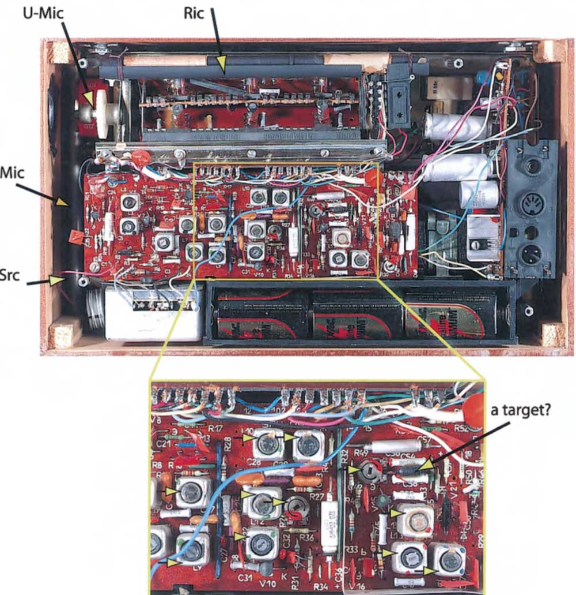
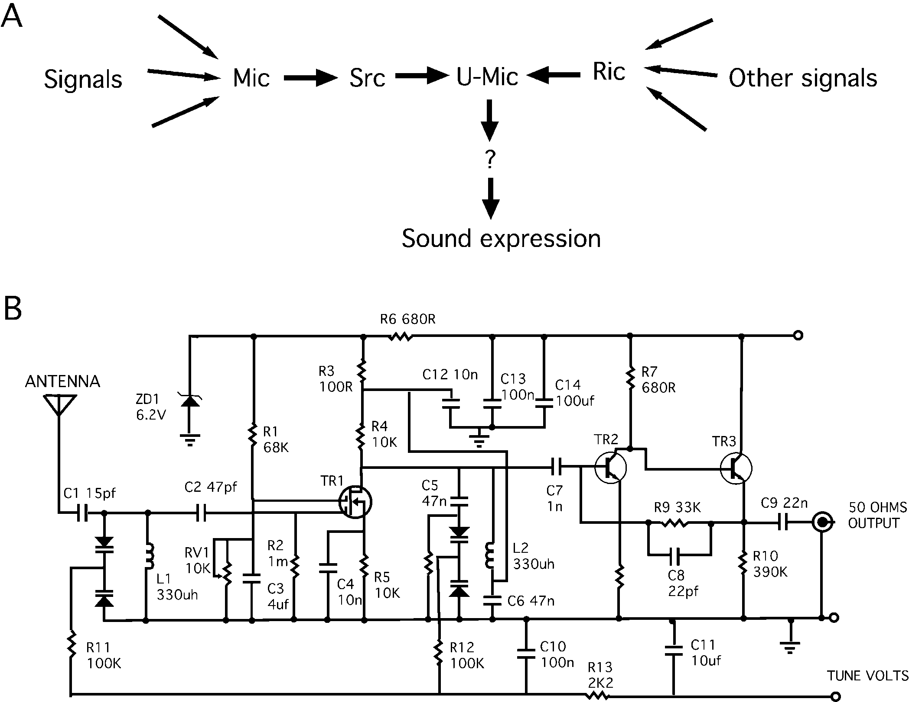
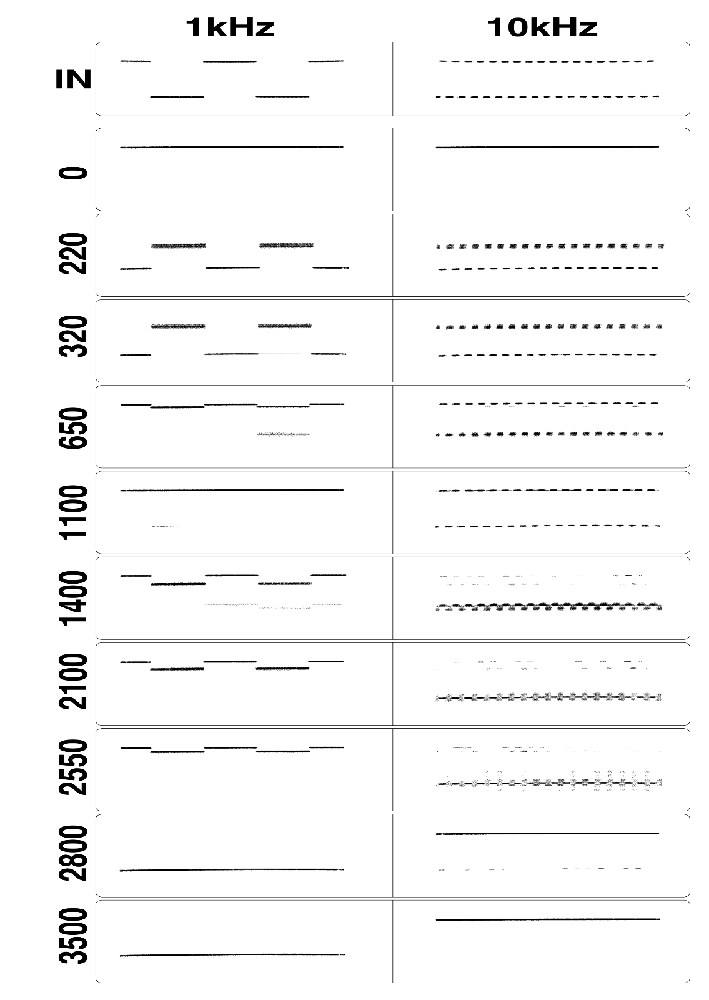
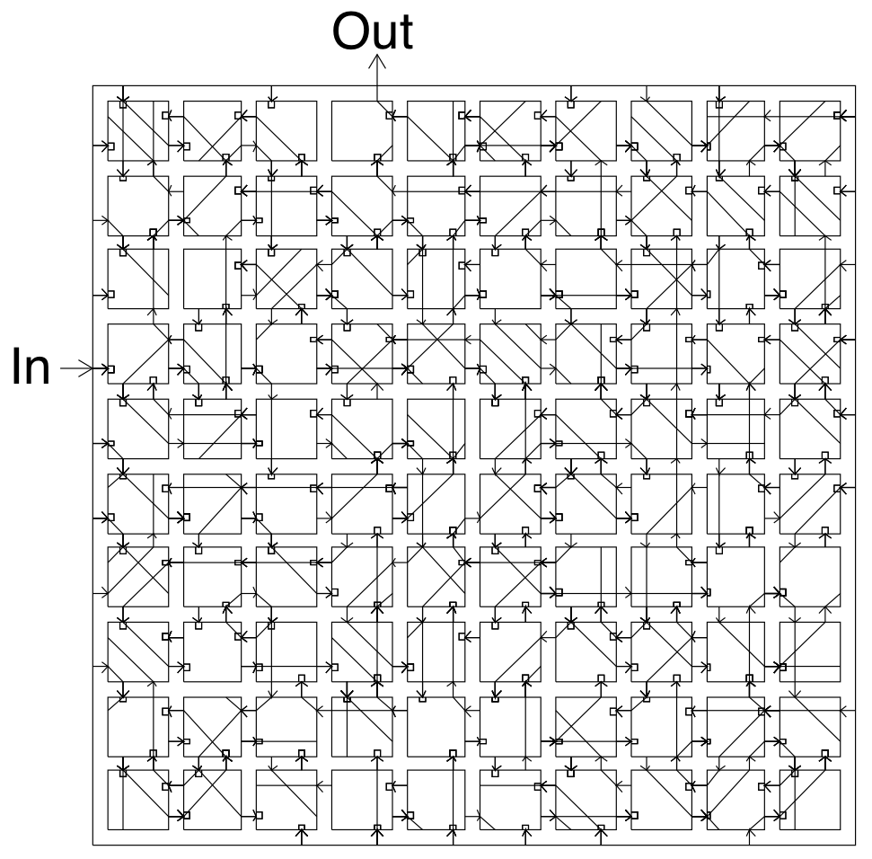
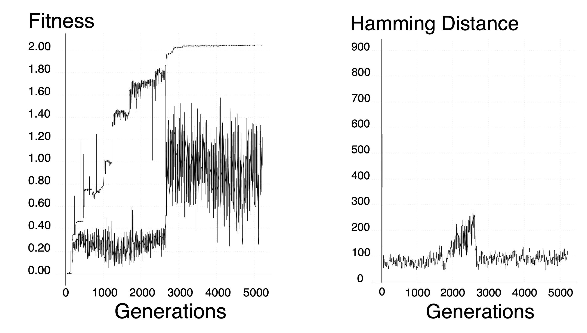
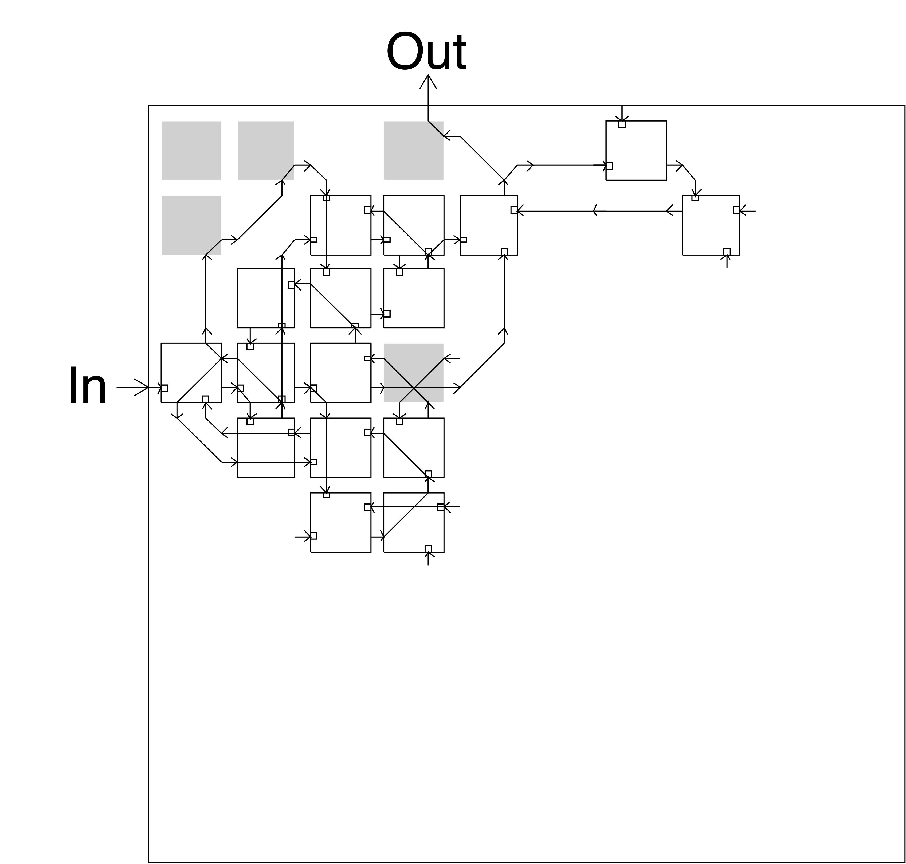
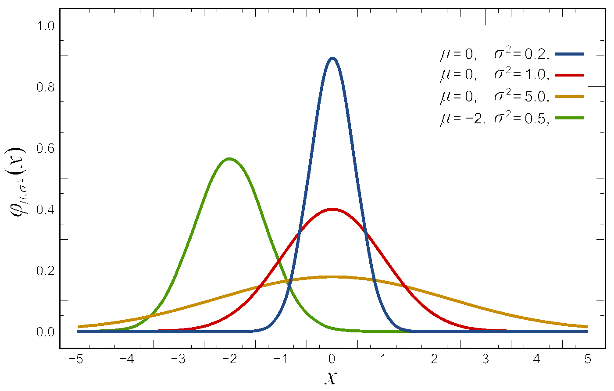
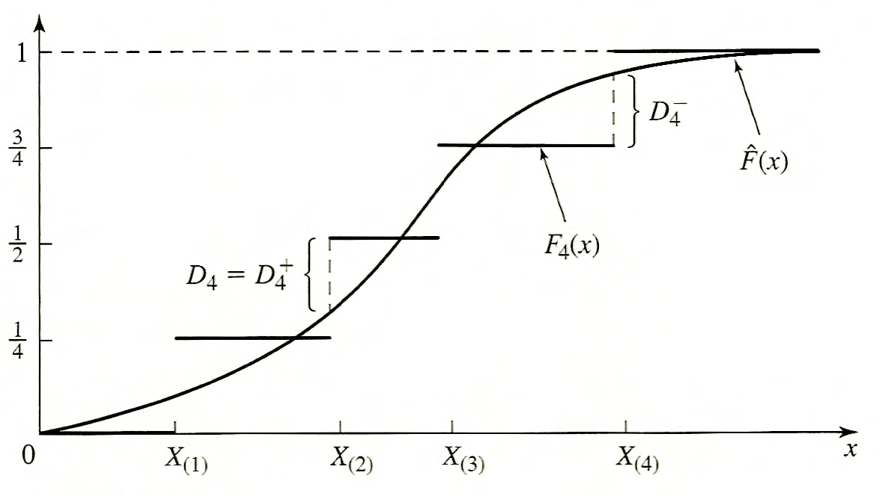

# Class overview

## Machine learning & data-driven modeling in bioengineering

### Lecture

- Tuesdays/Thursdays, 8–9:50 am
- Boelter 2760

### Lab

- Varies by section—check the course schedule.

## Lecture Slides

- Lecture slides will be posted on the course website.
- Finalized by the night before so you can print them out if you want.
- The slides are *not* everything, but will include space to fill out missing elements during class.

::: {.notes}
- Mention review questions at the start of lecture.
:::

### Textbook / Other Course Materials

- There is no textbook for this course.
- We will post related readings prior to each lecture.
- These will either broaden the scope of material covered in class or provide critical background.
- We will make it clear if the material is more than optional.

## Attendance

- We expect students to come to the lectures and discussion sessions.
- The lecture is recorded via BruinCast to accommodate personal circumstances.
- However, if the attendance level is too low, we will stop releasing the video.

::: {.notes}
- We will share the lectures so long as attendance is over 80%.
:::

## Support / Office Hours

### Prof. Meyer

- Thursday, 10–10:50 am in Engineering V 4121G
- I will usually stick around after class and am happy to answer questions

### Prof. Tanigawa

- Tuesday, 10–10:50 am in Engineering V 5121E

### TAs

- By appointment
- Will have regular times set up soon

### Campuswire

- Allows for quick help from us, the TAs, and the LAs

::: {.notes}
- Go over TA availability.
- Go over how to get help.
:::

## Learning Goals:

By the end of the course you will have an increased understanding of:

1. _Critical Thinking and Analysis:_ Understand the process of identifying critical problems, analyzing current solutions, and determining alternative successful solutions.
2. _Engineering Design:_ Apply mathematical and scientific knowledge to identify, formulate, and solve problems in the chosen design area.
3. _Computational Modeling:_ Apply computational tools to solve and optimize engineering problems.
4. _Communicate Effectively:_ Learn how to give an effective presentation. Understand how to communicate progress orally and in written reports.
5. _Manage and Work in Teams:_ Learn to work and communicate effectively with peers to attain a common goal.

## Practical Learning Objectives

By the end of the course you will learn how to:

1. Identify whether and how a problem can be solved by machine learning.
2. Determine the prerequisites to applying the method.
3. Implement different techniques to solve the scientific/engineering task.
4. Critically assess machine learning results.

::: {.notes}
- Notice I don't say deriving a proof or writing some software package.
	- This class is about the _process_ of analysis.
	- More focused on developing your critical evaluation of statistical models.
- Mention survey on Bruin Learn.
:::

## Grade Breakdown

25%
~ Final Project

25%
~ Lab Assignments

40%
~ Midterms 1 & 2

10%
~ Class Participation

## Labs

### Sessions

- These are mandatory sessions.
- You will have an opportunity to get started on each week's implementation and/or work on your project.

### Computational Labs

- You will implement what we have learned using _real_ data from studies.
- These labs reinforce the material through hands-on practice.
- They are meant to help you become comfortable applying the material.
- Document your effort, get started early, and seek help in office hours, in lab, or on Campuswire.
- Your lowest lab grade will be automatically dropped.

::: {.notes}
- Cover Python, notebooks.
:::

---

### AI usage in Computational Labs

- UCLA provides access to Generative AI (GenAI) tools
	- https://dts.ucla.edu/initiatives/ai/available-tools
- GenAI tools help you perform the tasks you're familiar with, but mere reliance on them without critical assessment of their output may block your learning process
- We will ask you to (1) **declare** your use of those tools and (2) explain how you **verified** the outputs in assignments

## Project

- You will take data from a scientific paper, and implement a machine learning method using best practices.
- A list of papers and data repositories is provided on the website as suggestions.
- Absolutely go find ideas that interest you!
- More details to come.
- First deadline will be in week 3 to pick a project topic.

::: {.notes}
- Think about this now!
:::

## Exams

- We will have midterm exams on weeks 5 and 9.
- You will have a final project in lieu of a final exam.

::: {.notes}
- Go over class schedule.
:::

## Keys to Success

- Participate in an engaged manner with in-class and take-home activities.
- Turn assignments in on time.
- Work through activities, reading, and problems to ensure your understanding of the material.

If you do these three things, you will do well.

::: {.notes}
- Extensive changes this year, so I am interested in your feedback
- If you aren't familiar with a term, guaranteed we should review it
:::

# Introduction

## How do we need to learn about the world?

- What is a measurement?
- What is a model?

::: {.notes}
- Measurement: Observation about the world.
- Model: Theoretical explanation of the world.
- **Everything** is a model. Cover qualitative models.
:::

## Three things we need to learn about the world

- Measurements (data)
- Models (inference)
- Algorithms

::: {.notes}
Distinguish each of these.
:::

## Area of Focus

What we will cover spans a range of fields:

- Engineering (the data)
- Statistics (the model)
- Computational techniques (the algorithms)

::: {.notes}
- Makes this material challenging.
- Also rewarding, frontier of methods.
- Stop and talk about why statistics can be hard.
- One, students haven't seen it before.
- Two, it has both a mathematical and philosophical element.
:::

## Why do we need models to learn about the world?

::: {.notes}
- Model provides a **formal language** that allows unifying efforts by multiple investigators and helps identify/focus on complex system's key parameters.
- It may not be feasible for humans to learn on the scale / in the time allotted.
- Model construction serves as goal posts, i.e., a well-specified target we can compare and share.
- For many tasks, machine learning can perform better than a human would once you specify a model.
:::

## Can a biologist fix a radio?

{width=2in fig-alt="Photo of a radio."}

::: {.notes}
- A radio functions similarly to a signal transduction pathway.
- ~100 various components (resistors, capacitors, and transistors vs. molecules)
:::

---

### Reverse-engineering a radio

{width=2in fig-alt="Photo of the inside of a radio."}

::: {.notes}
- Biologists' approach: (1) open functionally normal radios; (2) describe and classify components; and (3) remove a component at a time and assess its phenotypic consequence.
- Can the information from this process fix a radio?
- Limited insights into tunable components.
:::

---

### Formal circuit representation

{width=2in fig-alt="Circuit diagram of a radio."}

::: {.notes}
- Engineers use standardized formal language.
- Any engineer trained in electronics would unambiguously understand a diagram and discuss it with others.
- Because the language is quantitative, it is suitable for quantitative analysis, including modeling
:::

## Comparisons

- Multiscale nature
	- Biology operates on many scales
	- Same is true for electronics
	- **But** electronics employ compartmentalization/abstraction to make understandable
- Component-wise understanding
	- Only provides basic characterization
	- Leads to "context-dependent" function
- Standardized formal language
	- Anyone can unambiguously understand the system
	- It enables quantitative analyses, including modeling

## Machine learning outperforms humans for some tasks

{width=2in fig-alt="Diagram of signals with different timings."}

::: {.notes}
- 'Intrinsic' Hardware Evolution, a process to design electronic circuits with a genetic algorithm.
- Task: discriminate between square waves of 1kHz and 10kHz presented at the input.
	- The circuit does not have access to a clock.
	- "Evolution was required to produce a configuration of the array of 100 logic cells to discriminate between input periods five orders of magnitude longer than the input."
:::

---

### The FPGA hardware setup to test a genetic algorithm (GA)

{width=2in fig-alt="Diagram of a programmable circuit with random connections."}

::: {.notes}
Thompson used Field Programmable Gate Array (FPGA) to instantiate the circuit design and measure the fitness.
:::

---

### The maximum and minimum fitness and genetic convergence

{width=2in fig-alt="Loss from stochastic fitting process."}

---

### Learned circuit

{width=2in fig-alt="Diagram of a fit circuit that performs the desired function."}

::: {.notes}
- The largest set of cells that could have their function unit outputs simultaneously clamped to constant values (0 or 1) without affecting the behavior.
	- "The cells shaded gray cannot be clamped without degrading performance, even though there is no connected path by which they could influence the output."
	- "They must be influencing the rest of the circuit by some means other than the normal cell-to-cell wires."
:::

# Basic Statistical Concepts

## Data

- What is a variable?
- What is an observation?
- What is N?

## Types of variables

- Categorical
- Numerical/continuous
- Ordinal

## Probability

- Probability indicates the chance of an event within a broader set of outcomes.
- $X$: random variable with possible outcomes $x \in \Omega$
- **First axiom**: $p(x) \geq 0$
- **Second axiom**: $\sum_{x}p(x) = 1$
- **Third axiom**: $p(A \cup B) = p(A) + p(B)$ for mutually exclusive events $A$ and $B$.
 
::: {.notes}
- Also talk about if something is conditionally dependent/independent
- What is integral?
- What is the limit as dx goes to 0?
:::

---

### Examples

#### Dice rolling example

- Consider rolling a dice
- The possible outcomes ($\Omega$) are $\{1, 2, 3, 4, 5, 6\}$
	- They are mutually exclusive.
- Let's verify the three axioms.
	- $p(X = i) \geq 0$ for all $i \in \Omega$.
	- $\sum_{i = 1}^6 p(X = i) = 1$.
	- $p(X = i \cup X = j) = p(X = i) + p(X = j)$ if $i \neq j$.

::: {.notes}
- The modeling language allows us to focus on key parameters of the system.
	- We don't care about the color or size of a dice.
:::

---

#### Coin toss example

A set of trials: HTHHHTTHHTT

Two possibilities:

- Fair coin (heads 50%, tails 50%)
- Biased (heads 60%, tails 40%)

::: {.notes}
- Run through example.
- What is the data here?
- What is the model?
- What is the algorithm?
- Walk through each form of probability.
- Probabilities are 0.00049 fair, 0.00048 biased.
:::

---

### Probability distributions

We've already been talking about these! Distributions describe the range of probabilities that exist for all possible outcomes.

::: {.notes}
- The choice of distribution implies a specific underlying process.
- Can a distribution be categorical? Ordinal? Numerical?
:::

---

### Other probability concepts

Joint probability
~ In a multivariate probability space, the distribution for more than one variable. $p(X, Y)$.

Conditional probability
~ The measure of an event given that another event has occurred. $p(X \mid Y) = p(X, Y)/p(Y)$.

Marginal distribution
~ The probability distribution regardless of other observations/factors. $p(X) = \sum_{Y}p(X, Y)$.

Complementary event
~ The probability of an event not occurring. $p(X^c) = 1 - p(X)$.

::: {.notes}
- Plot out a joint probability
- Also talk about if something is conditionally dependent/independent
:::

## Normal distributions

- Also known as Gaussian Distributions
- Two model parameters
	- $\mu$: center of the distribution
	- $\sigma$: standard deviation
- $\sigma^2$: variance

$$f(x)={\frac {1}{\sqrt {2\pi \sigma ^{2}}}}e^{-{\frac {(x-\mu )^{2}}{2\sigma ^{2}}}}$$

---

{width=2in fig-alt="PDF of a normal distribution."}

---

### Standard normal distribution

For a *standard* normal distribution ($\mu = 0$, $\sigma = 1$):

$$f(x)=\frac{1}{\sqrt{2\pi}}\; e^{-\frac{x^2}{2}}$$

Area between:

- One standard deviation: 68%
- Two standard deviations: 95%
- Three standard deviations: 99.7%

You can normalize any normal distribution to the standard normal.

::: {.notes}
- Walk through the equations for normal distribution.
- Walk through process of Z-scoring.
:::

## Other commonly used distributions

- **Normal distribution**: common for many naturally observed variables; often summarized by its mean and standard deviation.
- **Poisson distribution**: counts events in a fixed interval.
- **Exponential distribution**: describes the time between events in a Poisson process.
- **Gamma distribution**: often used for modeling waiting times and in Bayesian statistics.
- **Bernoulli distribution**: a binary outcome, like a coin flip.
- **Binomial distribution**: the number of successes in a sequence of Bernoulli trials.
- **Multinomial distribution**: a generalization of the binomial distribution for more than two states.

## Distribution moments

The moments of a distribution describe its shape: $$\mu_{n}=\int_{-\infty}^{\infty}(x-c)^{n}\,f(x)\,\mathrm{d} x$$

- Mean ($n=1$), variance ($n=2$), skewness ($n=3$), kurtosis ($n=4$)
- Essential properties to determining how data will behave during analysis:
	- How might your measurements need to change with changes in variance?
	- What are these values for a normal distribution?

<https://gregorygundersen.com/blog/2020/04/11/moments/>

::: {.notes}
- For a standard normal distribution, mean = 0, variance = 1, skewness = 0, kurtosis = 3.
:::

# Sample statistics

## Sampling distributions

If we sampled a finite number of times (let's say **sample size** of $n=3$), we could build a **sampling** distribution of the statistics (e.g., one for the **sample** mean and one for the **sample** standard deviation).

General properties of sampling distributions:

1. The sampling distribution of a statistic *often* tends to be centered at the value of the population parameter estimated by that statistic
2. The spread of the sampling distributions of many statistics *tends* to grow smaller as sample size $n$ increases
3. **Central Limit Theorem**: As $n$ increases, the sampling distribution of the sample mean tends toward normality. $\bar{X} \approx N\left(\mu, \frac{\sigma^2}{n}\right)$

::: {.notes}
- Unbiased estimates vs. biased estimates.
:::

---

### Sample mean

- This means that as $n$ increases, the sample mean $\bar{X}$ is a better estimate of $\mu$.
	- The standard error is the standard deviation of the sample mean.
- When a population distribution is normal, the sampling distribution of the sample statistic is also normal, regardless of $n$.
- And the central limit theorem states that the sampling distribution can be approximated by a normal distribution when the sample size, $n$, is sufficiently large.
- A common rule of thumb is that $n=30$ is sufficiently large, but there are times when smaller $n$ will suffice. Greater $n$ may be required with higher **skewness**.

## Hypothesis Testing

In hypothesis testing, we state a null hypothesis that we will test; if the p-value is less than a chosen threshold, then we reject it.

For example:

- $H_0$: A particular set of points comes from a normal distribution with mean $\mu$ and variance $\sigma^2$.
- $H$: Two sets of observations were sampled from distributions with different means.

When we do an experiment, we typically take a **sampling** of several observations, to be more certain of the result.

::: {.notes}
- Go over this, drawing out distributions.
- Go over one sided, two sided tests.
:::

## T-distribution

The t-distribution with $n-1$ degrees of freedom is useful for **comparing means** with small sample size $n$ and unknown population variance.

- $H_0$: Assume $\mu=\mu_0$ then calculate t. $$t = \frac{\overline{x} - \mu_0}{s/\sqrt{n}}$$
	- You can think of $t$ as $z/s$, where it is sensitive to the magnitude of the difference from the null and scaled to control for the spread.
- When comparing two means under the equal-variance assumption: $$t=\frac{\bar{X}_1-\bar{X}_2}{s_p\sqrt{\frac{1}{n_1}+\frac{1}{n_2}}}$$
	- Here, $s_p$ is the pooled standard deviation.

## Effect size

- The scalar factor scales the t-value
	- For normal data, the standard error scales as $1 / \sqrt{n}$
		- p-values can become significant even with a small difference in means
- Exercise caution and report the effect size
	- For example, a 1% or 50% difference in the means

## Kolmogorov-Smirnov test

- Comparison of an empirical distribution function with the distribution function of the hypothesized distribution.
- Does not depend on the grouping of data.
- Relatively insensitive to outlier points (i.e., distribution tails).

---

### Geometric intuition

- K-S test is most useful when the sample size is small
- Geometric meaning of the test statistic:

{width=2in fig-alt="Schematic of the K-S test."}

::: {.notes}
- Intuition: largest vertical gap between $F(x)$ and $\hat{F}(x)$ across all $x$
- We use univariate Normal distribution with $n=4$ observations
	- No t-distribution available here.
- $F(x)$: theoretical CDF, $F(x)=P(X \le x)$; smooth curve from the hypothesized distribution  
- $\hat{F}(x)$: empirical CDF, $\hat{F}(x)=\frac{\#\{X_i \le x\}}{n}$; step function from data  
- Ordered data: $X_{(1)} \le X_{(2)} \le X_{(3)} \le X_{(4)}$  
- Empirical CDF values: just before $X_{(i)}$: $\frac{i-1}{4}$; just after $X_{(i)}$: $\frac{i}{4}$  
- $D_4^+ = \max_i \left(\frac{i}{4} - F(X_{(i)})\right)$ (empirical above model)  
- $D_4^- = \max_i \left(F(X_{(i)}) - \frac{i-1}{4}\right)$ (model above empirical)  
- $D_4 = \max(D_4^+, D_4^-)$  
:::

---

### Test statistic

This is the operation that creates the sample distribution.

$$D_n^{+} = \max_{1\leq i\leq n} \left(\frac{i}{n} - \hat{F}(X_{(i)})\right)$$
$$D_n^{-} = \max_{1\leq i\leq n} \left(\hat{F}(X_{(i)}) - \frac{i - 1}{n}\right)$$
$$D_n = \max \left( D_n^{+}, D_n^{-} \right)$$

Not expressed in one equation with absolute value because distance is assessed from opposite ends for each.

How is this then converted to a p-value?

::: {.notes}
- $D_n$ is a random variable (depends on the sample)
- Under $H_0$, $\hat{F}(x)$ fluctuates around $F(x)$
- So $D_n$ has a known distribution under the null
	- As $n \to \infty$: $\sqrt{n} D_n \Rightarrow \sup_{t \in [0,1]} |B(t)|$
	- $B(t)$: Brownian bridge (random fluctuation constrained at endpoints) 
	- Start: $B(0) = 0$ (both CDFs start at 0)
	- End: $B(1) = 0$ (both CDFs end at 1)
- Interpretation: fluctuations of $\hat{F}(x) - F(x)$ over $t \in [0,1]$
- p-value = $P(D_n^{\text{null}} \ge D_n^{\text{observed}})$
	- i.e., probability of seeing a gap at least this large by chance
:::

## Graphical Analysis

- Plotting a distribution is often more informative than a test.
- It not only assesses deviation, but can also explain where it occurs.
- Many variants:
	- [Q-Q plot](https://en.wikipedia.org/wiki/Q%E2%80%93Q_plot) (quantile-quantile plot)
	- [P-P plot](https://en.wikipedia.org/wiki/P%E2%80%93P_plot) (probability-probability plot or percent-percent plot)
	- Histogram with fitted distribution

::: {.notes}
- Q-Q plot and P-P plot: both compare empirical distribution vs theoretical distribution (graphically)  
	- Often more informative than a single test statistic  
- Q-Q plot: empirical quantiles vs theoretical quantiles  
  - If distributions match, then points lie on a straight line  
  - Deviations indicate *where* distributions differ  
  - Sensitive to differences in tails  
- P-P plot: $\hat{F}(x)$ vs $F(x)$  
  - If distributions match, then points lie on diagonal ($y = x$)  
  - Directly compares cumulative probabilities  
  - Less sensitive to tail differences  
- Intuition  
  - Q-Q: compares *values (quantiles)*  
  - P-P: compares *probabilities (CDFs)*  
:::

## Type I and Type II errors in hypothesis testing

- Type I error: error of rejecting $H_0$ when it is true (false positive)
- Type II error: not rejecting $H_0$ when it is false (false negative)
- Alpha: significance level; in the long run, $H_0$ would be rejected falsely this fraction of the time (i.e., we are willing to accept an $x$ fraction of false positives)

Beware of goodness-of-fit tests because they are unlikely to reject *any* distribution with little data, and are very sensitive to the smallest systematic error with lots of data.

## Multiple hypotheses

We want to test whether gene expression differs between two cells more than would be expected by chance alone. We test the two samples with a p-value cutoff of 0.05:

- How many false positives would we expect after testing 20 genes?
- How about 1000 genes?

What about false negatives?

What does this mean when it comes to hypothesis testing?

# Review

## Reading & Resources

- 📖: [Can a biologist fix a radio?](https://www.cell.com/cancer-cell/fulltext/S1535-6108(02)00133-2)
- 👂: [Linear Digressions: The Normal Distribution and the Central Limit Theorem](https://lineardigressions.com/episodes/2018/12/9/the-normal-distribution-and-the-central-limit-theorem)
- 📺: [But what is the Central Limit Theorem?](https://www.youtube.com/watch?v=zeJD6dqJ5lo)
- 📖: [Understanding Moments](https://gregorygundersen.com/blog/2020/04/11/moments/)
- 📖: [Computer Age Statistical Inference, Chapters 1 and 2](https://hastie.su.domains/CASI/order.html)
- 💾: [`scipy.stats`](https://docs.scipy.org/doc/scipy/reference/stats.html)

## Review Questions {.smaller}

1. What are 4 reasons to build a model?
2. $p(x) = a/x$ for $1 < x < 10$ describes a distribution pdf. What is $a$? What is the expression for the distribution mean?
3. What are the three kinds of variables? Give an example of each.
4. You are interested in the sample distribution of the mean for an exponential distribution (N=8). What can you say about it relative to the original one?
5. What can you say about the sample distribution for the N=1 case?
6. Studying an anti-tumor compound, you create 2 tumors in either flank (i.e. 1 mouse gets 2 tumors) of 5 mice, then treat the animals with a compound, measuring tumor growth. What is N? Justify your answer.
7. You want to model a process where each successive outcome is 1/5 as likely (e.g., getting 3 is 1/5 as likely as getting 2). What is the expression for this distribution?
