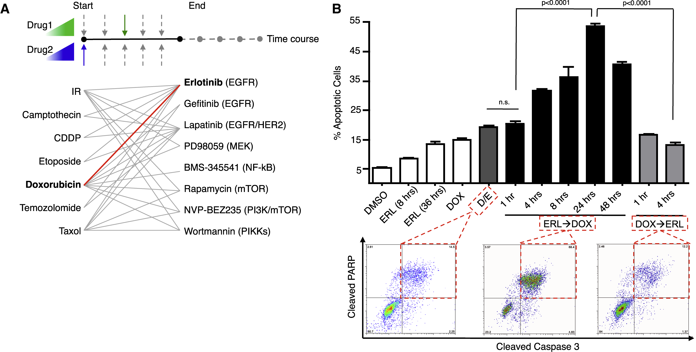
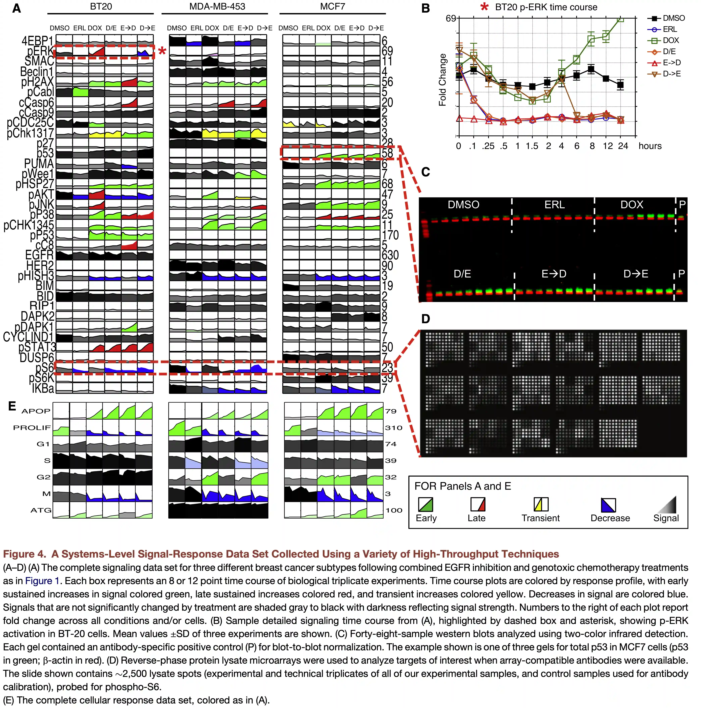
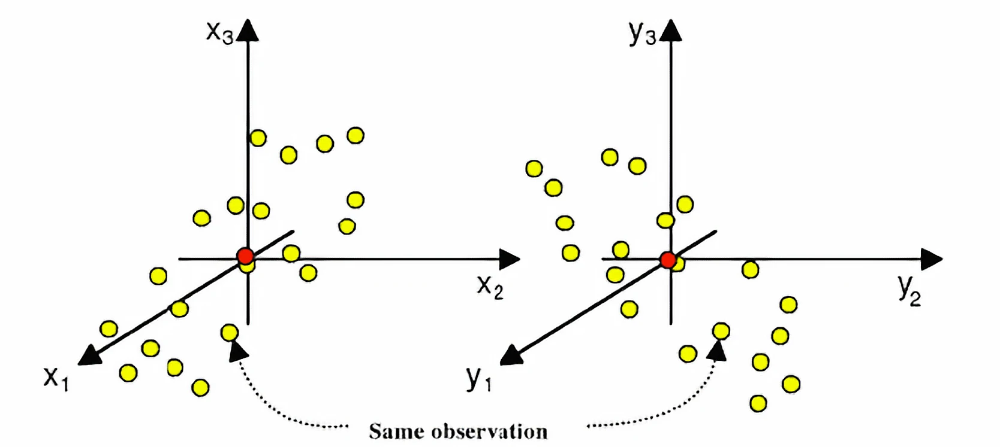
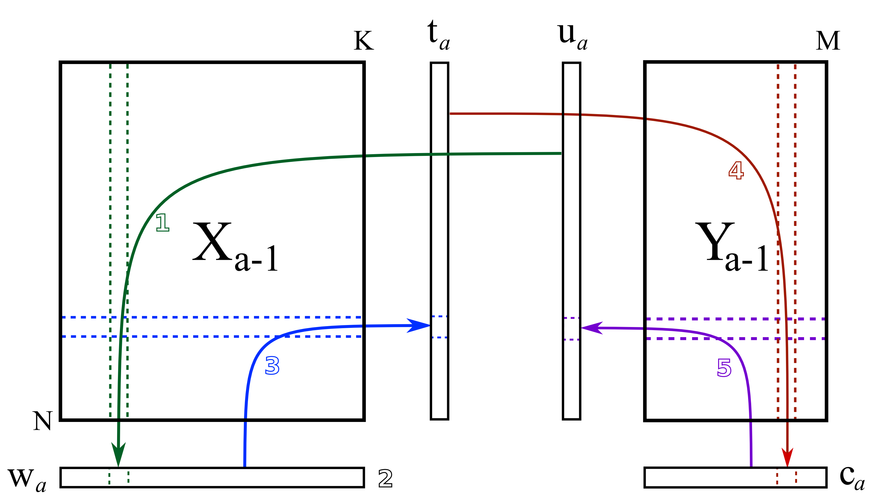
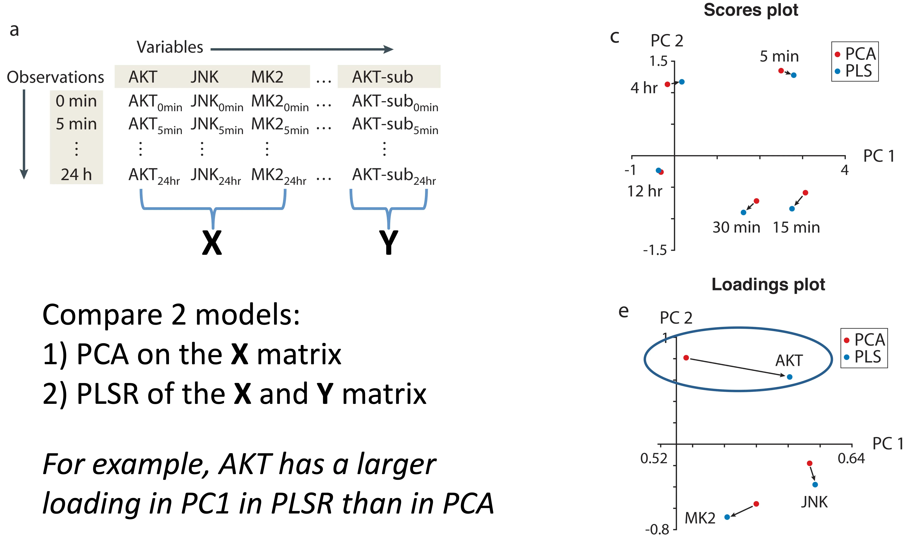
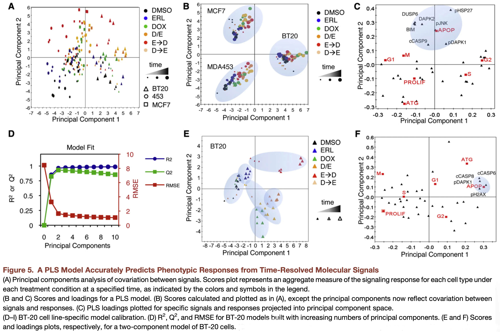
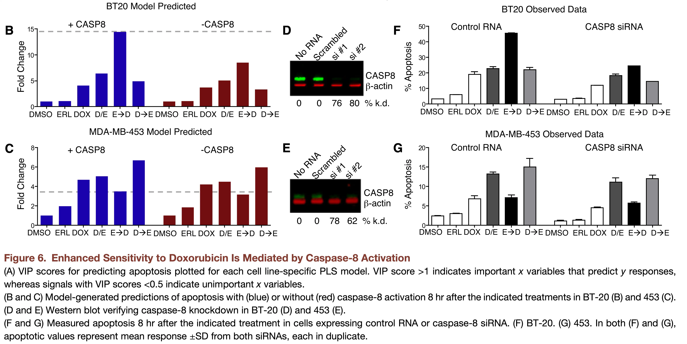

# Common challenge: Finding *coordinated changes* within data

---

{fig-alt="Diagram from Lee et al. showing the challenge of finding coordinated changes in complex biological data."}

--- 

{fig-alt="Bar chart or heatmap showing how the timing and order of drug treatment affects cell death percentage."}

--- 

{fig-alt="Figure from Lee et al. likely showing the experimental setup or results related to drug combinations."}

## Notes about the methods today

- We will cover two related methods today: principal components regression (PCR) and partial least squares regression (PLSR).
- Both methods are used for supervised prediction; however, they have a number of distinct properties from other methods we will discuss.
- PCR constructs components using only $\mathbf{X}$, while PLSR uses information from both $\mathbf{X}$ and $\mathbf{Y}$ when constructing latent directions.
- Learning about PLSR is more difficult than it should be, partly because papers describing it span areas of chemistry, economics, medicine and statistics, with differences in terminology and notation.

## Regularization

- Both PCR and PLSR can act as forms of regularization.
- Reduce the dimensionality of our regression problem to $N_{\textrm{comp}}$ components.
- Prioritize certain variance in the data.

# Principal Components Regression (PCR)

## Core idea

One solution: use the concepts from PCA to reduce dimensionality.

First step: **Simply apply PCA!**

Dimensionality goes from $m$ to $N_{\textrm{comp}}$.

::: {.notes}
- What are the bounds on the number of components we can have?
- What might be a concern as a consequence of this? (How do we determine how many components to keep?)
:::

## Principal Components Regression

1. Decompose the $\mathbf{X}$ matrix (scores $\mathbf{T}$, loadings $\mathbf{P}$, residuals $\mathbf{E}_X$):

$$ \mathbf{X} = \mathbf{T}\mathbf{P}^\top + \mathbf{E}_X $$

2. Regress $\mathbf{Y}$ against the scores (scores describe observations, so they link $\mathbf{X}$ and $\mathbf{Y}$ for each observation)

$$ \mathbf{Y} = \mathbf{T}\mathbf{B} + \mathbf{E}_Y $$

::: {.notes}
- What is the residual against here?
:::

## How do we determine the right number of components to use for our prediction?

::: {.notes}
- Cross-validation with varying numbers of components
:::

## A remaining potential problem

- The PCs for the $\mathbf{X}$ matrix do not necessarily capture variation in $\mathbf{X}$ that is important for $\mathbf{Y}$.
- Standard PCR can struggle when predictive signal lies in lower-variance directions.
- There are a few developments around PCR that aim to improve prediction or interpretability.

---

### Recent developments around PCR (advanced topics)

#### `pcLasso`: the LASSO meets PCR

- `pcLasso` is a supervised regression method that combines sparsity with shrinkage toward leading principal-component directions.
- It can be helpful when predictors are highly correlated and we want both good prediction and a smaller, more interpretable set of features.

#### Supervised PCA

- Supervised PCA uses association with $\mathbf{Y}$ to select features before performing PCA and regression.
- It can help when many features are irrelevant to prediction.

::: {.notes}
- The basic idea is: use Y to identify features that are more likely to matter, then run a PCR-style workflow on those features.
- This keeps the PCA + regression structure, but introduces supervision earlier than ordinary PCR.
- Bair et al. Prediction by Supervised Principal Components. 2006.
:::

# Partial Least Squares Regression (PLSR)

## The core idea of PLSR

What if, instead of choosing components based only on variance in $\mathbf{X}$, we choose latent directions that maximize the **co**variance between scores derived from $\mathbf{X}$ and $\mathbf{Y}$?

::: {.notes}
- Go over definition of covariance.
- cov(X, X) = var(X)
- var(Y) = cov(X, Y) + variance in Y independent of X
- A factorization occurs to find max covar with Y
- Forces direction of components
:::

## What is covariance?

Covariance measures how two variables vary together:

$$ \mathrm{cov}(x, y) = \frac{1}{n-1}\sum_{i=1}^{n}(x_i - \bar{x})(y_i - \bar{y}) $$

## PLSR is a cross-decomposition method

We will find latent components for both $\mathbf{X}$ and $\mathbf{Y}$:

$$ \mathbf{X} = \mathbf{T}\mathbf{P}^\top + \mathbf{E} $$

$$ \mathbf{Y} = \mathbf{U}\mathbf{Q}^\top + \mathbf{F} $$

{fig-alt="Diagram of PLSR as a cross-decomposition method, showing X decomposing into T and P, and Y decomposing into U and Q, with a relationship between T and U."}

## Algorithm to find PLSR solutions

- Iterative minimization while exchanging scores
- NIPALS: nonlinear iterative partial least squares

## NIPALS while exchanging the scores

### Step 1: Take a random column of $\mathbf{Y}$ to be $\mathbf{u}_a$, and regress it against $\mathbf{X}$.

$$ \mathbf{w}_a = \dfrac{1}{\mathbf{u}_a^\top\mathbf{u}_a} \cdot \mathbf{X}_a^\top\mathbf{u}_a $$

{fig-alt="Flowchart or diagram illustrating the iterative steps of the NIPALS algorithm for Partial Least Squares."}

---

### Step 2: Normalize $\mathbf{w}_a$.

$$ \mathbf{w}_a = \dfrac{\mathbf{w}_a}{\sqrt{\mathbf{w}_a^\top \mathbf{w}_a}} $$

{fig-alt="Flowchart or diagram illustrating the iterative steps of the NIPALS algorithm for Partial Least Squares."}

---

### Step 3: Regress $\mathbf{w}_a$ against $\mathbf{X}_a$ to obtain $\mathbf{t}_a$.

$$ \mathbf{t}_a = \dfrac{1}{\mathbf{w}_a^\top\mathbf{w}_a} \cdot \mathbf{X}_a\mathbf{w}_a $$

{fig-alt="Flowchart or diagram illustrating the iterative steps of the NIPALS algorithm for Partial Least Squares."}

---

### Step 4: Regress $\mathbf{t}_a$ against $\mathbf{Y}_a$ to obtain $\mathbf{c}_a$.

$$ \mathbf{c}_a = \dfrac{1}{\mathbf{t}_a^\top\mathbf{t}_a} \cdot \mathbf{Y}_a^\top\mathbf{t}_a $$

{fig-alt="Flowchart or diagram illustrating the iterative steps of the NIPALS algorithm for Partial Least Squares."}

---

### Step 5: Regress $\mathbf{c}_a$ against $\mathbf{Y}_a$ to obtain $\mathbf{u}_a$.

$$ \mathbf{u}_a = \dfrac{1}{\mathbf{c}_a^\top\mathbf{c}_a} \cdot \mathbf{Y}_a\mathbf{c}_a $$

{fig-alt="Flowchart or diagram illustrating the iterative steps of the NIPALS algorithm for Partial Least Squares."}

---

### Step 6: Cycle until convergence

Cycle until convergence, then subtract off the variance explained by $\widehat{\mathbf{X}}_a = \mathbf{t}_a\mathbf{p}_a^\top$ and $\widehat{\mathbf{Y}}_a = \mathbf{t}_a \mathbf{c}_a^\top$.

{fig-alt="Flowchart or diagram illustrating the iterative steps of the NIPALS algorithm for Partial Least Squares."}

## Components in PLSR and PCA Differ

{fig-alt="Figure from Janes et al (2006) comparing the principal components derived from PCA and PLSR, showing how they capture different variance."}

## Determining the Number of Components

$R^2X$ provides the variance explained in $\mathbf{X}$:

$$ R^2X = 1 - \frac{\left\Vert \mathbf{X}_{\textrm{PLSR}} - \mathbf{X} \right\Vert_F^2}{\left\Vert \mathbf{X} \right\Vert_F^2} $$

$R^2Y$ shows the variance explained in $\mathbf{Y}$:

$$ R^2Y = 1 - \frac{\left\Vert \mathbf{Y}_{\textrm{PLSR}} - \mathbf{Y} \right\Vert_F^2}{\left\Vert \mathbf{Y} \right\Vert_F^2} $$

If you are trying to predict something, you should look at the cross-validated $R^2Y$ (a.k.a. $Q^2Y$).

## PLSR uncovers coordinated cell death mechanisms

{fig-alt="Figure from Lee et al. showing how PLSR helps uncover coordinated cell death mechanisms."}

---

{fig-alt="Additional figure from Lee et al. illustrating the results of PLSR analysis on cell death mechanisms."}

# Practical Notes

## PCR

- scikit-learn does not implement PCR directly
- Can be applied by chaining [`sklearn.decomposition.PCA`](https://scikit-learn.org/stable/modules/generated/sklearn.decomposition.PCA.html) and [`sklearn.linear_model.LinearRegression`](https://scikit-learn.org/stable/modules/generated/sklearn.linear_model.LinearRegression.html)
- See: [`sklearn.pipeline.Pipeline`](https://scikit-learn.org/stable/modules/generated/sklearn.pipeline.Pipeline.html)

## PLSR

- [`sklearn.cross_decomposition.PLSRegression`](https://scikit-learn.org/stable/modules/generated/sklearn.cross_decomposition.PLSRegression.html)
	- Uses `M.fit(X, Y)` to train
	- Can use `M.predict(X)` to get new predictions
	- `PLSRegression(n_components=3)` to set the number of components at initialization
	- Or `M.n_components = 3` after initialization, followed by refitting the model

## Comparison: PLSR vs. PCR

### PCR

- Uses PCA as an initial decomposition step, then is just normal linear regression
- PCA maximizes the variance explained in the independent (X) data
- Useful if you want to capture unbiased structure in X and it is aligned with biological variations you care about

### PLSR

- Chooses components to maximize covariance between latent scores derived from $\mathbf{X}$ and $\mathbf{Y}$
- Takes into account both the dependent (Y) and independent (X) data
- Useful to capture subtle but coordinated biological effect

## Performance of PLSR

- PLSR can be very effective for prediction, especially when predictors are highly correlated and the signal is low-dimensional
	- This is **incredibly** powerful, especially when the response depends on coordinated variation spread across many correlated features
- Interpreting **why** PLSR predicts something can be challenging

# Review

## Which method would you use?

- We will consider several hypothetical scenarios involving datasets $\mathbf{X}$ and $\mathbf{Y}$.
- For each scenario, decide which method you would try:
	- **PCA**: principal component analysis for unsupervised dimensionality reduction
	- **OLS**: ordinary least squares regression
	- **Lasso**: sparse linear regression with an $l_1$ penalty
	- **PCR**: principal components regression
	- **PLSR**: partial least squares regression

---

### Scenario 1: Single-cell RNA-seq (cell type discovery)

You have:

- $\mathbf{X}$: gene expression (20,000 genes $\times$ 5,000 cells)  
- $\mathbf{Y}$: coarse labels (e.g., "treated" vs "control")  
- Goal: understand major sources of variation and visualize cell populations  

**Which would you use: PCA, OLS, Lasso, PCR, or PLSR? Why?**

::: {.notes}
**Answer: PCA**

- Goal is exploratory --> understand structure in X  
- Major variation = cell type, cell cycle, batch  
- Y is coarse and not the main driver  
- PCA is the natural tool for visualization and unsupervised structure discovery
- PLSR or PCR would bias components toward prediction rather than exploration
:::

---

### Scenario 2: Drug response prediction (high-dimensional, correlated features)

You have:

- $\mathbf{X}$: gene expression (10,000 genes $\times$ 200 cell lines)  
- $\mathbf{Y}$: drug sensitivity (continuous IC50)  
- Goal: predict drug response from high-dimensional molecular measurements  
- Predictive signal is weak but spread across many correlated genes  

**Which would you use: PCA, OLS, Lasso, PCR, or PLSR? Why?**

::: {.notes}
**Answer: PLSR**

- Goal is prediction  
- Signal is distributed across many features  
- Likely not aligned with top variance PCs  
- PLSR captures covariance with Y  
- Classic use case in systems biology / pharmacogenomics  
:::

---

### Scenario 3: Clinical outcome with noisy labels

You have:

- $\mathbf{X}$: proteomics data (500 proteins $\times$ 80 patients)  
- $\mathbf{Y}$: an electronic health record (EHR)-derived inflammation score aggregated from multiple hospitals and measurement pipelines  
- Goal: build a robust predictor despite substantial outcome noise  
- Small sample size  

**Which would you use: PCA, OLS, Lasso, PCR, or PLSR? Why?**

::: {.notes}
**Answer: PCR (leaning PCR)**

- Y is noisy --> PLSR risks overfitting  
- EHR-derived scores can mix multiple sources of technical and clinical variability
- Small $n$ --> variance matters  
- PCR provides stable components  
- Then test whether those components are associated with clinical outcome  
- More conservative / robust  
:::

---

### Scenario 4: Sparse biomarker model

You have:

- $\mathbf{X}$: gene expression (5,000 genes $\times$ 150 samples)  
- $\mathbf{Y}$: expression level of a developmental marker gene  
- Goal: predict marker expression with a small, interpretable set of regulators  
- You believe only a small number of upstream regulators are truly important, and you want an interpretable predictive model  

**Which would you use: PCA, OLS, Lasso, PCR, or PLSR? Why?**

::: {.notes}
**Answer: Lasso**

- We believe the true signal is sparse
- Lasso encourages many coefficients to be exactly zero
- This can improve interpretability and variable selection
- PCR/PLSR spread signal across components rather than selecting a small gene set
:::

---

### Scenario 5: Hidden low-variance biology

You have:

- $\mathbf{X}$: metabolomics data (300 metabolites $\times$ 120 samples)  
- $\mathbf{Y}$: subtle treatment effect  
- Goal: detect and predict a weak biological effect hidden by stronger background variation  
- Treatment effect is small compared to diet/environment variation  

**Which would you use: PCA, OLS, Lasso, PCR, or PLSR? Why?**

::: {.notes}
**Answer: PLSR**

- Signal is in low-variance directions  
- PCA will prioritize diet/environment effects  
- PCR likely misses treatment signal  
- PLSR pulls out directions aligned with Y  
:::

## Reading & Resources

- 📖: [How the PLS model is calculated](https://learnche.org/pid/latent-variable-modelling/projection-to-latent-structures/how-the-pls-model-is-calculated)
- 📖: [AMW: Partial Least Squares Regression](https://allmodelsarewrong.github.io/pls.html)
- 📖: [Using Partial Least Squares Regression to Analyze Cellular Response Data](https://www.science.org/doi/10.1126/scisignal.2003849)

## Review Questions {.smaller}

1. What are three differences between PCA and PLSR in implementation and application?
2. What is the difference between PCR and PLSR? When does this difference matter more/less?
3. How might you need to prepare your data before using PLSR?
4. How can you determine the right number of components for a model?
5. What feature of biological data makes PLSR/PCR useful relative to direct regularization approaches (LASSO/ridge)?
6. Can you apply K-fold cross-validation to a PLSR model? If so, when do you scale your data?
7. Can you apply bootstrapping to a PLSR model? Describe what this would look like.
8. You use the same X data but want to predict a different Y variable. Do your X loadings change in your new model? What about for PCR?
