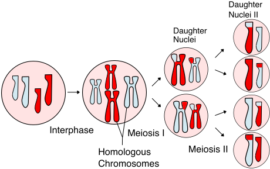
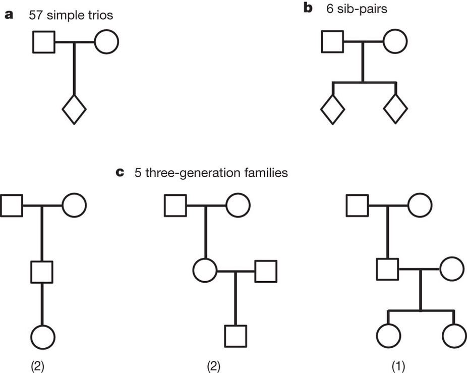
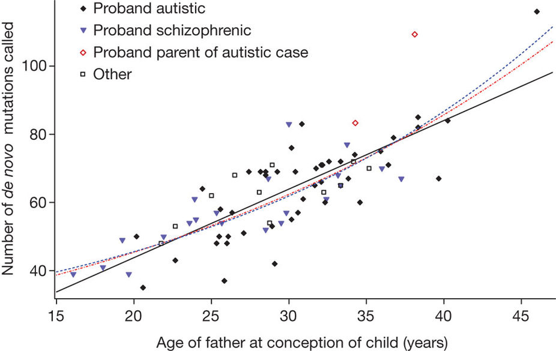
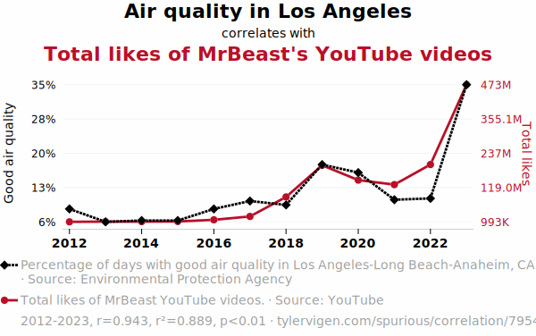
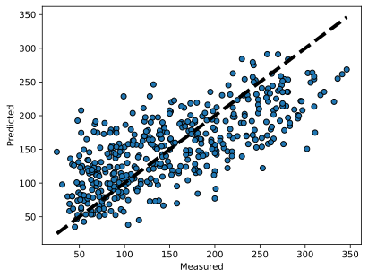
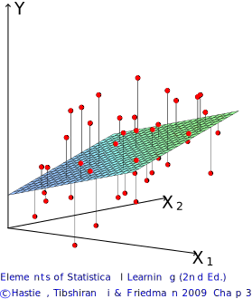
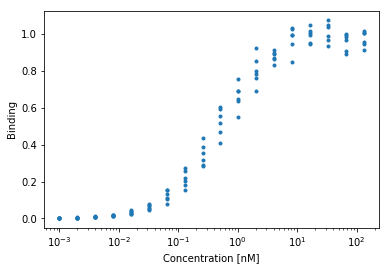
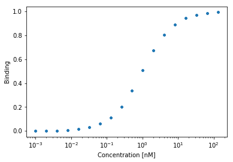

# Project Proposals

## Overview

In this project, you have two options for the general route you can take:

1. Reimplement analysis from the literature.
2. New, exploratory analysis of existing data.

More details in final project guidelines.

---

- The proposal should be less than one page and describe the following items:
	- Why the topic you chose is interesting
	- Demonstrate that your project fits the criteria above
	- What overall approach do you plan to take for the project and why
	- Demonstrate that your project can be finished within a month, including **data availability**
	- Estimate the difficulty of your project
- **We are available to discuss your ideas whenever you are ready, and you should discuss your idea with us prior to submitting your proposal.**
- *Recommend an early start—the earlier you finalize a proposal the sooner you can begin the project.*

# Application

## Paternal *de novo* mutations

### Questions:

- Where do *de novo* mutations arise?
- Are there factors that influence the rate of *de novo* mutations from one generation to another?

## Application: Paternal *de novo* mutations

Meiosis of a cell with 2n=4 chromosomes.

{fig-alt="Schematic of cells undergoing meiosis." height=500}

::: {.notes}
What is different about paternal vs. maternal meiosis?
:::

## Application: Paternal *de novo* mutations

{fig-alt="Title and abstract from Kong et al." width=3in}

- How do you infer the relationship between parental age and the rate of *de novo* mutations?

---

#### *de novo* mutations data from trios

{fig-alt="Figure from Kong et al showing the family tree of several sample collections." width=2in}

---

Table. *De novo* mutations observed with parental origin assigned (Kong *et al*, *Nature*, 2012).

| Trio   | Father's age | Mother's age | Paternal chromosome | Maternal chromosome | Combined |
|--------|------------------:|------------------:|--------------------:|--------------------:|---------:|
| Trio 1 | 21.8 | 19.3 | 39 | 9  | 48 |
| Trio 2 | 22.7 | 19.8 | 43 | 10 | 53 |
| Trio 3 | 25.0 | 22.1 | 51 | 11 | 62 |
| Trio 4 | 36.2 | 32.2 | 53 | 26 | 79 |
| Trio 5 | 40.0 | 39.1 | 91 | 15 | 106 |
| Mean   | 29.1 | 26.5 | 55.4 | 14.2 | 69.6 |
| s.d.   | 8.4  | 8.8  | 20.7 | 7.0  | 23.5 |

::: {.notes}
The data are from five trios in which the proband also had a sequenced child (a third generation).
:::

---

{fig-alt="Figure from Kong et al showing a significant correlation between father age and number of de novo mutations." width=2in}

::: {.notes}
Fig 2. The number of de novo mutations called is plotted against the father’s age at conception of the child for the 78 trios. The solid black line denotes the linear fit. The dashed red curve is based on an exponential model fitted to the combined mutation counts. The dashed blue curve corresponds to a model in which maternal mutations are assumed to have a constant rate of 14.2 and paternal mutations are assumed to increase exponentially with father’s age.
:::

# Fitting

## Goal Of Fitting

- Fitting is the process of comparing a model to a compendium of data
- After fitting, we will have a model that explains existing data and can predict new data

::: {.notes}
- Use AlphaFold activity?
- Method of the year in 2021.
:::

## Process of Fitting

The *process* of fitting is choosing parameter values so that a model explains the observed data as well as possible.

The key factor is how one defines the problem—i.e., how the distribution is described.

## Three ingredients of a fitting problem

- **Model form**: What relationship do we assume between inputs and outputs?
- **Loss / objective**: What does it mean for the model to fit the data well?
- **Assumptions**: What statistical assumptions make the fit interpretable?

::: {.notes}
- Keep these separate throughout the lecture.
- Example for OLS:
	- Model: linear
	- Loss: sum of squared error
	- Assumptions: independent Gaussian noise with constant variance
:::

## Caveats

- Any fitting result is highly dependent upon the correctness of the model
- Successful fitting requires concordance between the model and data
	- Too little data and a model is underdetermined
	- Unaccounted for variables can lead to systematic error

> Since all models are wrong the scientist cannot obtain a "correct" one by excessive elaboration. On the contrary following William of Occam he should seek an economical description of natural phenomena. Just as the ability to devise simple but evocative models is the signature of the great scientist so overelaboration and overparameterization is often the mark of mediocrity. ~George Box, *J American Stat Assoc*, 1976

::: {.notes}
- Von Neumann: The truth is too complicated to allow anything but approximation.
:::

## Any Fitting Depends on Model Correctness

{fig-alt="A chart showing a spurious correlation between two random measurements over time." width=2in}

Fitting does not happen in a vacuum!

::: {.notes}
Walk through model, what the model is, etc.
:::

<!-- Page 97 of Computer Age Statistical Inference -->

# Ordinary Least Squares

## Ordinary Least Squares (OLS)

- Probably the most widely used estimation technique.
- Closely connected to maximum likelihood under a Gaussian noise model.
- Model assumes the output quantity is a linear combination of inputs.

{fig-alt="Plot of measured vs. predicted values of scikit-learn's diabetes dataset." width=2in}

::: {.notes}
- Every model will have:
	- Mathematical definition
	- Geometric interpretation
	- Intuitive "feel"
:::

---

### Model setup

If we have a vector of $n$ observations $\mathbf{y}$, our predictions are going to follow the form:

$$ \mathbf{y} = \mathbf{X} \boldsymbol{\beta} + \boldsymbol{\epsilon} $$

Here:

- $\mathbf{X}$ is a $n \times p$ structure matrix (a.k.a. design matrix)
- $\boldsymbol{\beta} \in \mathbb{R}^p$ is the vector of model parameters (regression coefficients)
- $\boldsymbol{\epsilon} = \left( \epsilon_1, \epsilon_2, ... \epsilon_n \right)^\top$ is the noise present in the model
	- Usual assumptions: uncorrelated and have constant variance $\sigma^2$: 

$$ \boldsymbol{\epsilon} \sim \left( \mathbf{0}, \sigma^2 \mathbf{I} \right) $$

::: {.notes}
- Graph this
- Discuss the source of noise. What will happen if there is non-Gaussian component unaccounted?
:::

---

### Intuition

OLS picks the line, plane, or hyperplane that makes predictions as close as possible to the observed data in total squared distance.

{fig-alt="Linear least squares fitting with X \in R^2. We seek the linear function of X that minimizes the sum of squared residuals from Y. Elements of Statistical Learning (2nd Ed.) (c) Hastie, Tibshirani, and Friedman. 2009."}

::: {.notes}
- For a single variable, this is the "best fit line."
- "Squared" makes large errors count more heavily and gives a tractable solution.
:::

---

### Single variable case

For a single input variable, ordinary least squares is just:

$$ \mathbf{y} = m \mathbf{x} + \beta_0 + \boldsymbol{\epsilon} $$

Here, $m$ is the slope, $\beta_0$ is the intercept, and $\boldsymbol{\epsilon}$ is the noise.

::: {.notes}
- This is the familiar line equation.
	- Use this before generalizing to multiple predictors.
- Go through why you would need to transform the data
- Write out on the board how this corresponds to shifted distributions
:::

---

### Multiple variable case

The structure matrix is little more than the data, sometimes transformed, usually with an intercept (offset). So, another way to write:

$$ \mathbf{y} = \mathbf{X} \boldsymbol{\beta} + \boldsymbol{\epsilon} $$

would be:

$$ \mathbf{y} = m_1 \mathbf{x}_1 + m_2 \mathbf{x}_2 + \ldots + \beta_0 + \boldsymbol{\epsilon} $$

The values of $m$ and $\beta_0$ that minimize the sum of squared error (SSE) are optimal.

::: {.notes}
- Connect back to the single-variable line fit.
- Then generalize to many variables.
:::

---

#### Including the intercept term

Consider including the intercept $\beta_0$ by augmenting the design matrix $\mathbf{X}$ and parameter vector $\boldsymbol{\beta}$:

$$ \mathbf{X} \boldsymbol{\beta} =
\left(\mathbf{1} \; \mathbf{x}_1 \; \mathbf{x}_2 \; \cdots \; \mathbf{x}_p \right)
\begin{pmatrix}
\beta_0 \\
\beta_1 \\
\beta_2 \\
\vdots \\
\beta_p
\end{pmatrix}
$$

Now, the standard notation considers the intercept.

$$ \mathbf{y} = \mathbf{X} \boldsymbol{\beta} + \boldsymbol{\epsilon} $$

---

### Least-squares objective and closed-form solution

Gauss and Markov in the early 1800s identified that the least squares estimate of $\boldsymbol{\beta}$, $\hat{\boldsymbol{\beta}}$, is obtained by minimizing the total squared error:

$$ \hat{\boldsymbol{\beta}} = \arg\min_{\boldsymbol{\beta}}{\left\Vert \mathbf{y} - \mathbf{X} \boldsymbol{\beta} \right\Vert^{2}} $$ <!-- Eq 7.31 -->

When $\mathbf{X}^\top \mathbf{X}$ is invertible, this can be directly calculated by:

$$ \hat{\boldsymbol{\beta}} = \mathbf{S}^{-1} \mathbf{X}^\top \mathbf{y} $$ <!-- Eq 7.32 -->

where 

$$ \mathbf{S} = \mathbf{X}^\top \mathbf{X} $$ <!-- Eq 7.33 -->

::: {.notes}
$$ \frac{\delta}{\delta \boldsymbol{\beta}} \left(\left\Vert \mathbf{y} - \mathbf{X} \boldsymbol{\beta} \right\Vert^{2}\right) = 0 $$
$$ 2 \mathbf{X}^\top (\mathbf{y} - \mathbf{X} \boldsymbol{\beta}) = 0 $$
$$ 2 \mathbf{X}^\top \mathbf{y} = 2 \mathbf{X}^\top \mathbf{X} \boldsymbol{\beta} $$
$$ \boldsymbol{\beta} = \left(\mathbf{X}^\top \mathbf{X} \right)^{-1} \mathbf{X}^\top \mathbf{y} $$
:::

---

### Ordinary Least Squares and Maximum Likelihood

#### Why does least squares make sense?

$$ \log L(\boldsymbol{\beta},\sigma^{2}) = -\frac{n}{2} \log(2\pi\sigma^{2}) - \frac{1}{2 \sigma^{2}} \sum_{i=1}^{n} (y_{i}-\mathbf{x}_{i}^\top \boldsymbol{\beta})^{2} $$

Under the Gaussian noise assumption, maximizing the likelihood is therefore equivalent to minimizing:

$$ \sum_{i=1}^{n} (y_{i}-\mathbf{x}_{i}^\top \boldsymbol{\beta})^{2} $$

So least squares is also the maximum likelihood estimate under this model.

---

### Statistical properties of the estimator

$\hat{\boldsymbol{\beta}}$ is the maximum likelihood estimate of $\boldsymbol{\beta}$, and has covariance $\sigma^2 \mathbf{S}^{-1}$:

$$\hat{\boldsymbol{\beta}}\sim{}N\left(\boldsymbol{\beta},\sigma^2 \mathbf{S}^{-1}\right)$$

In the normal case (when our assumptions hold), $\hat{\boldsymbol{\beta}}$ is an *unbiased estimator* of $\boldsymbol{\beta}$. Making these calculations tractable for larger data sets used to be a challenge but is now trivial.

::: {.notes}
- How do we know $\sigma$?
	- The sample standard deviation is a common estimate of $\sigma$
	- So the standard deviation of the residuals is a natural estimate
- Go through where the likelihood arises from. Leave this up for later.

$$ f(x | \mu, \sigma^2) = \frac{1}{\sqrt{2\pi\sigma^2}} e^{-\frac{(x-\mu)^2}{2\sigma^2}} $$

$$ \ln f(x | \mu, \sigma^2) = -\frac{1}{2}\ln(2\pi\sigma^2) - \frac{(x-\mu)^2}{2\sigma^2} $$

$$ \ln L(\mu, \sigma^2 | x_1, x_2, \ldots, x_n) = -\frac{n}{2}\ln(2\pi\sigma^2) - \frac{1}{2\sigma^2}\sum_{i=1}^{n}(x_i-\mu)^2 $$

$$ \ln L(\boldsymbol{\beta}, \sigma^2 \mid \mathbf{y}) = -\frac{n}{2}\ln(2\pi\sigma^2) - \frac{1}{2\sigma^2} (\mathbf{y} - \mathbf{X}\boldsymbol{\beta})^\top(\mathbf{y} - \mathbf{X}\boldsymbol{\beta}). $$
:::

---

### Advantages and limitations

#### When should we use ordinary least squares (OLS)?

- What are some of the assumptions?
- What are the implications of these assumptions not holding?
- What are some downsides?

::: {.notes}
- Advantages:
	- Only has p parameters.
	- Can be directly calculated from data (without an optimization procedure; fit and uncertainty can be directly calculated.)
	- Fast
	- Easily quantify error
	- Scalable
	- Clear assumptions
	- Clearly interpretable
- Limitations:
	- Very sensitive to outliers.
	- Fails for p > n.

$$ \frac{\partial \ln L}{\partial \boldsymbol{\beta}} = \frac{1}{\sigma^2}\mathbf{X}^\top(\mathbf{y}-\mathbf{X}\boldsymbol{\beta}) $$
:::

## Implementation

scikit-learn provides a very basic function for ordinary least squares.

#### scikit-learn

- `sklearn.linear_model.LinearRegression`
  - `fit_intercept`: Should an intercept value be fit?
  - Centering or scaling the input variables should typically be done as a separate preprocessing step
- No tests for significance/model performance included.
- We'll discuss evaluating the model in depth later.

---

#### NumPy

Or there's an even more bare-bones function in NumPy: `numpy.linalg.lstsq`.

- Takes input variables `A` and `B`.
- Solves the equation $Ax=B$ by computing a vector $x$ that minimizes the Euclidean 2-norm $\lVert B-Ax \rVert^2$.

---

#### Example

~~~python
from sklearn.linear_model import LinearRegression
from sklearn.datasets import load_diabetes
from matplotlib import pyplot as plt

lr = LinearRegression()
data = load_diabetes()

y = data.target
lr.fit(data.data, y) # X, y

predicted = lr.predict(data.data)

fig, ax = plt.subplots()
ax.scatter(y, predicted, edgecolors=(0, 0, 0))
ax.plot([y.min(), y.max()], [y.min(), y.max()], 'k--', lw=4)
ax.set_xlabel('Measured')
ax.set_ylabel('Predicted')
~~~

::: {.notes}
- Run this as a notebook.
	- https://colab.research.google.com/drive/1PgyReaN48dMhP-qZ4kCQ4EQyXNZ-iXyM?usp=sharing
- Play with options.
:::

---

{fig-alt="Plot of measured vs. predicted values of scikit-learn's diabetes dataset." width=2in}

This plot shows *training-set* fit only. It is useful for illustration, but it does **not** tell us how well the model will generalize to new data.

# Non-Linear Least Squares

## Non-Linear Least Squares

Non-Linear Least Squares makes similar assumptions to ordinary least squares, but for arbitrary functions. Thus, instead of following the form:

$$ \mathbf{y} = \mathbf{X} \boldsymbol{\beta} + \boldsymbol{\epsilon} $$

Our input-output relationship is:

$$ \mathbf{y} = f(\mathbf{X}, \boldsymbol{\beta}) + \boldsymbol{\epsilon} $$

for the same construction of $\boldsymbol{\epsilon} \sim \left( \mathbf{0}, \sigma^2 \mathbf{I} \right)$.

::: {.notes}
- Independent points
- Normal error
- $f(x)$ relationship
:::

## Transformation

- Non-linear least squares used to be mostly performed by transforming one's data into a linear model.
	- For instance, by taking the ratio of variables, or log-transforming them.
- This is now considered **bad practice**.
- **Why?**

::: {.notes}
- Distorts error term.
- But made it easier to calculate.
:::

## Why move to non-linear least squares?

If we believe the underlying relationship is **non-linear** (e.g., curved), it is usually better to fit that curved model directly than to force the data into a linear form by transformation.

::: {.notes}
- The goal is still the same: choose parameters that make predictions close to the data.
- The difference is that the model itself is now nonlinear in the parameters.
:::

## Non-Linear Least Squares

### Algorithms

We again need to solve for $\boldsymbol{\beta}$ to minimize the sum of squared error (SSE):

- There are many methods to solve these problems, and finding the true minimum is not a trivial task.
- We're not going to cover how these algorithms work in depth.

## Non-Linear Least Squares

### Algorithms

One property we can take advantage of is that the gradient of the SSE with respect to $\boldsymbol{\beta}$ at the minimum is zero ($r_i$ is the residual of the $i$th point):

$$ {\frac {\partial S}{\partial \beta_j}}=2\sum_i r_i{\frac {\partial r_i}{\partial \beta_j}}=0 $$

- $\frac{\partial r_i}{\partial \beta_j}$ is a function of both the non-linear function and the data.
- This can be expanded out through a first-order Taylor approximation.
- Doing so essentially performs ordinary least squares around the current point, for the linearized function.

---

$$ {\frac {\partial S}{\partial \beta_j}}=2\sum_i r_i{\frac {\partial r_i}{\partial \beta_j}}=0 $$

- $\frac{\partial r_i}{\partial \beta_j}$ is a function of both the non-linear function and the data.
- This can be expanded out through a first-order Taylor approximation.
- Doing so essentially performs OLS around the current point.
	- ${\frac{\partial r_i}{\partial \beta_j}}= -J_{ij}$, where $J$ is the Jacobian of the function.
	- Many non-linear least-squares solvers require $J$ for this reason; it can be approximated by finite differences.
	- Probably the most common method, Gauss-Newton, uses this property with Newton's method.

## Non-Linear Least Squares

### Algorithms - Key Takeaways

- Unlike ordinary least squares, no guarantee about finding the optimal solution.
- Depending upon the data and model, there may be many local minima.
- This can still be interpreted in terms of shifting normal distributions around the data.

## Implementation

SciPy's `scipy.optimize.least_squares` is a very capable implementation.

- The main necessary parameters are:
	- `fun`, the function
	- `x0`, an initial guess for the parameter values
- Note that `fun` should return a vector of the residuals
	- So it should handle all the data itself

## NNLS Example

### Binding Data

Let's say we're looking at a protein-protein interaction such as this:

~~~python
plt.semilogx(X, Y,'.');
plt.xlabel('Concentration [nM]')
plt.ylabel('Binding')
~~~

{width=2in fig-alt="Scatter plot of protein binding data versus concentration."}

::: {.notes}
- Run this as a notebook.
:::

---

Let $X$ denote ligand concentration and let $\beta = k_1$ denote the association constant. We can predict the amount of binding we'd observe from a single-site binding model. 

$$
y = f(X, \beta) + \epsilon
$$

where,

$$
f(X, \beta) = \frac{X\beta}{1 + X\beta}
$$

---

#### Implementation

We can define custom function: $f([L], k) = \frac{k[L]}{1 + k[L]}$

~~~python
def klotz1(k1, lig):
    """
    Calculates the fractional binding for a single-site receptor model.
    
    Args:
        k1: The association constant. Higher values indicate stronger binding affinity.
        lig: The concentration of the free ligand.
		
    Returns:
	    The predicted fractional occupancy (Y). 
		This will be a value strictly between 0.0 (no binding) and 1.0 (100% saturation).
    """
	return (k1*lig)/(1 + k1*lig)
~~~

::: {.notes}
Klotz binding model
- R + L <-- --> RL, $k = [RL]/[R][L]$

$$
\begin{aligned}
Y &= \frac{[RL]}{[R]_\textrm{tot}} \\
  &= \frac{[RL]}{[R] + [RL]} \\
  &= \frac{k[R][L]}{[R] + k[R][L]} \\
  &= \frac{k[L]}{1 + k[L]}
\end{aligned}
$$
:::

---

~~~python
plt.semilogx(X,klotz1(1.,X),'.')
plt.xlabel('Concentration [nM]')
plt.ylabel('Binding')
~~~

{width=2in fig-alt="Scatter plot of protein binding data versus concentration with a fitted single-site binding model curve."}

## NNLS Example

### Binding Data

SciPy asks for the residuals at each fitting point, so we need to convert a prediction to that:

~~~python
def ls_obj_k1(k1, ligs, data):
	return data - klotz1(k1, ligs)
~~~

---

~~~python
sp.optimize.least_squares(ls_obj_k1, 1., args=(X,Y))
# --------
 active_mask: array([ 0.])
		cost: 0.0086776496708916573
		 fun: array([  4.79e-05,   9.00e-05,  -1.09e-04,
		 8.04e-04,  -9.67e-04,   3.85e-03,
		 4.61e-03,   2.34e-03,   2.36e-02,
		 9.64e-03,  -2.48e-02,   1.93e-02,
		-4.93e-02,   5.54e-02,  -3.66e-02,
		 2.97e-03,   3.39e-02,  -8.74e-02])
		grad: array([ -9.57228474e-09])
		 jac: array([[-0.00099809],
	   [-0.00199235],
	   [-0.0039695 ],
# ...
	   [-0.01608763],
	   [-0.00817133]])
	 message: '`gtol` termination condition is satisfied.'
		nfev: 4
		njev: 4
  optimality: 9.5722847420895082e-09
	  status: 1
	 success: True
		   x: array([ 0.95864059])
~~~

# How to select the right model?

## Generalized Linear Model

### What if the error term isn't Gaussian?

- In many cases linear regression can be inappropriate
	- E.g. A measurement that is Poisson distributed
	- E.g. A binary outcome

::: {.notes}
- CLT works to your benefit here.
:::

### Logistic regression

- Commonly used to model binary outcomes.
	- $p(\mathbf{x}) = \frac{1}{1 + \exp\left(-\left(\beta_0 + \boldsymbol{\beta}^{\top}\mathbf{x}\right)\right)}$
- Can we simply use logistic regression to analyze the Binding Data?
	- **Why or why not?**

## Can/should we use logistic regression for binding data?

- The choice depends on what you know about the system.
	- If you have domain knowledge about receptor-ligand binding, a mechanistic model is usually preferable because its parameters are interpretable.
- We *can* use logistic regression for binding data.
- There *is* a connection: the Klotz binding model can be written in a logistic-like form.

---

### The Klotz binding model and logistic regression

$$
\begin{aligned}
y &= \frac{k[L]}{1 + k[L]} = \frac{1}{1 + (k[L])^{-1}} \\
  &= \frac{1}{1 + \left( \exp(\ln(k)) \cdot \exp(\ln([L])) \right)^{-1}} \\
  &= \frac{1}{1 + \exp \left( -\left( \ln(k) + \ln([L]) \right) \right)}
\end{aligned}
$$

- Logistic regression with the *logarithm* of ligand concentration, $\ln([L])$, is related to the Klotz binding model.
- The scaling and transformation of the variables matters.

---

## How to select the right model?

- If you have domain knowledge about the system, use it.
	- Mechanistic models can give interpretable parameter estimates.
- If you do **not** have a mechanistic model, use a statistical model whose assumptions are reasonable.
	- Off-the-shelf models often have good documentation, toy examples, and efficient implementations.
- Choose a model whose outputs answer your scientific question.
	- Good prediction alone is not always enough if the goal is interpretation.

::: {.notes}
Connection with the Klotz binding model

- The logistic-like behavior appears when the predictor is log concentration.
- This is a useful reminder that different models can produce similar functional shapes.
- If you know the system is receptor-ligand binding, the mechanistic model is typically preferable because the parameters have direct scientific meaning.
- If you do not have a mechanistic model, a statistical model may still be useful if its assumptions match the data and the question.
:::

# Review

## Questions

- Given the binding data presented here, do you think a least squares model is most appropriate?
- How might you test whether your data seems to follow the assumptions of your model?

::: {.notes}
- Can use ks-test in point 2.
:::

## Reading & Resources

- 📖: [Computer Age Statistical Inference, Chapter 8](https://hastie.su.domains/CASI/order.html)
- 📖: [Points of Significance: Simple linear regression](https://www.nature.com/nmeth/journal/v12/n11/full/nmeth.3627.html)
- 💾: [sklearn: Linear Models](https://scikit-learn.org/stable/modules/linear_model.html)
- 👂: [Linear Digressions: The assumptions of ordinary least squares](https://lineardigressions.com/episodes/2019/1/12/the-assumptions-of-ordinary-least-squares)
- 👂: [Linear Digressions: Convex (and non-convex) optimization](https://lineardigressions.com/episodes/2018/12/16/convex-and-non-convex-optimization)

::: {.notes}
- In summary:
	- Fitting is the process of optimizing the model.
	- OLS is exceptional in that we can directly calculate the answer.
	- OLS and NNLS shift normal distributions up and down around the line of prediction.
	- GLM can handle other distributions.
:::

## Review Questions {.smaller}

1. Are OLS or NNLS guaranteed to find the optimal solution?
2. How are new points predicted to be distributed in OLS?
3. How are new points predicted to be distributed in NNLS?
4. How might you determine whether the assumptions you made when running OLS are valid? (Hint: Think about the tests from lecture 1.)
5. What is a situation in which the _statistical_ assumptions of OLS can be valid but _calculating_ a solution fails?
6. You're not sure a function you wrote to calculate the OLS estimator (Gauss-Markov) is working correctly. What is another relationship you could check to make sure you are getting the right answer?
7. You've made a monitor that uses light scattering at three wavelengths to measure blood oxygenation. Design a model to convert from the light intensities to blood oxygenation using a set of calibration points. What is the absolute minimum number of calibration points you'd need? How would you expect new calibration points to be distributed?
8. A team member suggests that the light-oxygenation relationship from (7) is log-linear instead of linear, and suggests using log(V) with OLS instead. What would you recommend?
