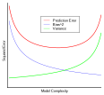
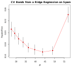
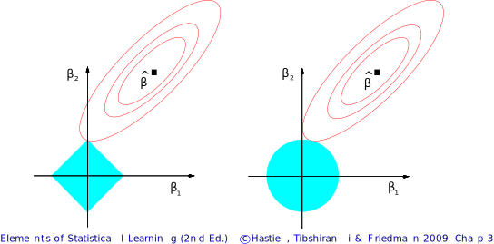

# Example

## Predicting Drug Response

{fig-alt="Title figure from the Cancer Cell Line Encyclopedia (CCLE) paper (Barretina et al., Nature 2012), illustrating the goal of predicting drug sensitivity from genomic features."}

---

{fig-alt="Figure 3 from the CCLE paper showing the performance of elastic net regression in predicting drug sensitivity compared to other methods."}

# The Bias-Variance Tradeoff

## Estimating $\boldsymbol{\beta}$

- As usual, we assume the model: $$y=f(\mathbf{z})+\epsilon, \epsilon\sim N(0,\sigma^2I)$$
- In regression analysis, our major goal is to come up with some good regression function $$\hat{f}(\mathbf{z}) = \mathbf{z}^\top \hat{\boldsymbol{\beta}}$$
- So far, we’ve been dealing with $\hat{\boldsymbol{\beta}}^{ls}$, or the least squares solution:
	- $\hat{\boldsymbol{\beta}}^{ls}$ has well-known properties (e.g., Gauss-Markov, ML)
- But can we do better?

## Choosing a good regression function

- Suppose we have an estimator $$\hat{f}(\mathbf{z}) = \mathbf{z}^\top \hat{\boldsymbol{\beta}}$$
- To see if this is a good candidate, we can ask ourselves two questions:
	1. Is $\hat{\boldsymbol\beta}$ close to the true $\boldsymbol{\beta}$?
	2. Will $\hat{f}(\mathbf{z})$ fit future observations well?
- These might have very different outcomes!!

---

### Is $\hat{\boldsymbol{\beta}}$ close to the true $\boldsymbol{\beta}$?

- To answer this question, we might consider the **mean squared error** of our estimate $\hat{\boldsymbol{\beta}}$:
	- i.e., consider squared distance of $\hat{\boldsymbol{\beta}}$ to the true $\boldsymbol{\beta}$: $$\textrm{MSE}(\hat{\boldsymbol{\beta}}) = \mathop{\mathbb{E}}\left[\lVert \hat{\boldsymbol{\beta}} - \boldsymbol{\beta} \rVert^2\right] = \mathop{\mathbb{E}}[(\hat{\boldsymbol{\beta}} - \boldsymbol{\beta})^\top (\hat{\boldsymbol{\beta}} - \boldsymbol{\beta})]$$
- **Example:** In least squares (LS), we know that: $$\mathrm{MSE}(\hat{\boldsymbol{\beta}}^{ls}) = \mathop{\mathbb{E}}[(\hat{\boldsymbol{\beta}}^{ls} - \boldsymbol{\beta})^\top (\hat{\boldsymbol{\beta}}^{ls} - \boldsymbol{\beta})] = \sigma^2 \mathrm{tr}[(\mathbf{Z}^\top \mathbf{Z})^{-1}]$$

---

#### Mean squared error of the least squares fit

$$\mathrm{MSE}(\hat{\boldsymbol{\beta}}^{ls}) = \sigma^2 \mathrm{tr}[(\mathbf{Z}^\top \mathbf{Z})^{-1}]$$

Interpretation:

- $\sigma^2$: the magnitude of noise in the linear model
- $(\mathbf{Z}^\top \mathbf{Z})^{-1}$: Sensitivity to the design matrix. Poorly conditioned or highly correlated predictors will lead to large MSE
- $\mathrm{tr}[(\mathbf{Z}^\top \mathbf{Z})^{-1}]$: Total variance across all coefficients

::: {.notes}
Recall the linear model: $\mathbf{y} = \mathbf{Z}\boldsymbol\beta + \boldsymbol\epsilon, \quad \boldsymbol\epsilon \sim N(0, \sigma^2 \mathbf{I})$

The least squares estimator is: $\hat{\boldsymbol{\beta}}^{ls} = (\mathbf{Z}^\top \mathbf{Z})^{-1} \mathbf{Z}^\top \mathbf{y}$

Under these assumptions, the estimator has distribution:
$$\hat{\boldsymbol{\beta}}^{ls} \sim \mathcal{N}\left(\boldsymbol{\beta},\; \sigma^2 (\mathbf{Z}^\top \mathbf{Z})^{-1}\right)$$

We define the mean squared error: $\mathrm{MSE}(\hat{\boldsymbol{\beta}}) = \mathbb{E}\left[\|\hat{\boldsymbol{\beta}} - \boldsymbol{\beta}\|^2\right]$

Let $\mathbf{x} = \hat{\boldsymbol{\beta}}^{ls} - \boldsymbol{\beta}$. Since the estimator is unbiased, $\mathbb{E}[\mathbf{x}] = 0$, and $\mathrm{MSE} = \mathbb{E}[\mathbf{x}^\top \mathbf{x}]$

A useful identity for zero-mean vectors:
$$\mathbb{E}[\mathbf{x}^\top \mathbf{x}] = \mathrm{tr}(\mathrm{Cov}(\mathbf{x}))$$

Applying this:
$$\mathrm{MSE}(\hat{\boldsymbol{\beta}}^{ls}) = \mathrm{tr}\left(\mathrm{Cov}(\hat{\boldsymbol{\beta}}^{ls})\right)
= \sigma^2 \mathrm{tr}\left((\mathbf{Z}^\top \mathbf{Z})^{-1}\right)$$
:::

---

### Will $\hat{f}(\mathbf{z})$ fit future observations well?

- Just because $\hat{f}(\mathbf{z})$ fits our data well does not mean that it will fit new data well
	- In fact, suppose that we take new measurements $y_i'$ at the same $\mathbf{z}_i$’s: $$(\mathbf{z}_1,\mathbf{y}_1'),(\mathbf{z}_2,\mathbf{y}_2'), \ldots ,(\mathbf{z}_n,\mathbf{y}_n')$$
	- So if $\hat{f}(\cdot)$ is a good model, then $\hat{f}(\mathbf{z}_i)$ should also be close to the new target $y_i'$
- This motivates **prediction error** (PE)

::: {.notes}
Have students draw lines for smoking vs. heart attack risk over data. Make two datasets to explain variance.
:::

---

#### Prediction error and the bias-variance tradeoff

- Good estimators should, on average, have small prediction errors
- Let’s consider the PE at a particular target point $\mathbf{z}_0$:
	- $\mathrm{PE}(\mathbf{z}_0) = \sigma_{\epsilon}^2 + \textrm{Bias}^2(\hat{f}(\mathbf{z}_0)) + \textrm{Var}(\hat{f}(\mathbf{z}_0))$, where
	- $\textrm{Bias}(\hat{f}(\mathbf{z}_0)) = \mathbb{E}[\hat{f}(\mathbf{z}_0)] - f(\mathbf{z}_0)$
	- $\textrm{Var}(\hat{f}(\mathbf{z}_0)) = \mathbb{E}\left[(\hat{f}(\mathbf{z}_0) - \mathbb{E}[\hat{f}(\mathbf{z}_0)])^2\right]$
- Such a decomposition is known as the **bias-variance tradeoff**

::: {.notes}
- Not going to derive, but comes directly from the definitions
:::

## Bias-variance tradeoff

$$
\mathrm{PE}(\mathbf{z}_0) = \sigma_{\epsilon}^2 + \textrm{Bias}^2(\hat{f}(\mathbf{z}_0)) + \textrm{Var}(\hat{f}(\mathbf{z}_0))
$$

- As model becomes more complex (more terms included), local structure/curvature is picked up
- But coefficient estimates suffer from high variance as more terms are included in the model
- So introducing a little bias in our estimate for **$\boldsymbol{\beta}$** ***might*** lead to a large decrease in variance, and hence a substantial decrease in PE
	- We'll cover a few well-known techniques

::: {.notes}
Bias-variance decomposition and Prediction Error (PE)

We start from the regression model:

$$
y = f(\mathbf{z}) + \epsilon, \quad \epsilon \sim (0, \sigma^2I)
$$

Our goal is to understand how well a fitted model $\hat{f}$ will predict new data.

Let $D$ denote the training data used to fit the model. At a new point $\mathbf{z}_0$,

$$
\mathrm{PE}(\mathbf{z}_0) = \mathbb{E}_{D,\epsilon}\left[(y_0 - \hat{f}_D(\mathbf{z}_0))^2\right].
$$

Since $y_0 = f(\mathbf{z}_0) + \epsilon$, we have $\mathrm{PE}(\mathbf{z}_0) = \mathbb{E}_{D,\epsilon}\left[(f(\mathbf{z}_0) + \epsilon - \hat{f}_D(\mathbf{z}_0))^2\right].$

Expanding the square gives

$$
\mathrm{PE}(\mathbf{z}_0)
= \mathbb{E}_{D,\epsilon}\left[(f(\mathbf{z}_0) - \hat{f}_D(\mathbf{z}_0))^2\right]
+ \mathbb{E}[\epsilon^2]
+ 2\mathbb{E}_{D,\epsilon}\left[\epsilon \bigl(f(\mathbf{z}_0) - \hat{f}_D(\mathbf{z}_0)\bigr)\right].
$$

The cross term is zero because $\epsilon$ has mean zero and is independent of the training data, so $\mathbb{E}_{D,\epsilon}\left[\epsilon \bigl(f(\mathbf{z}_0) - \hat{f}_D(\mathbf{z}_0)\bigr)\right] = 0.$

Therefore,

$$
\mathrm{PE}(\mathbf{z}_0)
= \sigma^2 + \mathbb{E}_D\left[(f(\mathbf{z}_0) - \hat{f}_D(\mathbf{z}_0))^2\right].
$$

Define

- $\mathrm{Bias}(\hat{f}(\mathbf{z}_0)) = \mathbb{E}_D[\hat{f}_D(\mathbf{z}_0)] - f(\mathbf{z}_0)$, and
- $\mathrm{Var}(\hat{f}(\mathbf{z}_0)) = \mathbb{E}_D\left[\left(\hat{f}_D(\mathbf{z}_0) - \mathbb{E}_D[\hat{f}_D(\mathbf{z}_0)]\right)^2\right].$

We have the bias-variance tradeoff:

$$
\mathrm{PE}(\mathbf{z}_0) = \sigma^2 + \mathrm{Bias}^2 + \mathrm{Var}.
$$

- $\sigma^2$ is irreducible noise.
- Bias is systematic error from model misspecification
- Variance is sensitivity to the training data

Bias term is squared, so a small amount is often acceptable if it reduces variance enough.
:::

---

### Depicting the bias-variance tradeoff

{.nostretch width=600 fig-alt="Graph illustrating the bias-variance tradeoff, showing how total error is minimized at an intermediate level of model complexity."}

::: {.notes}
- Regularization can be _anything_.
- Today we'll see two/three examples.
:::

# Ridge Regression

## Ridge regression: $l_2$ penalty as regularization

- If the $\beta_j$'s are unconstrained...
	- They can explode
	- And hence are susceptible to very high variance
- To control variance, we might **regularize** the coefficients
	- i.e., we might control how large the coefficients grow
- Might impose the ridge constraint (both equivalent):
	- minimize $\sum_{i=1}^n (y_i - \boldsymbol{\beta}^\top \mathbf{z}_i)^2\: \mathrm{s.t.} \sum_{j=1}^p \beta_j^2 \leq t$
	- minimize $(\mathbf{y} - \mathbf{Z}\boldsymbol{\beta})^\top (\mathbf{y} - \mathbf{Z}\boldsymbol{\beta})\: \mathrm{s.t.} \sum_{j=1}^p \beta_j^2 \leq t$
- By convention (**very important**):
	- **Z** is assumed to be standardized (mean 0, unit variance)
	- **y** is assumed to be centered

---

### Penalized residual sum of squares (PRSS)

- Can write the ridge constraint as the following **penalized** residual sum of squares (PRSS):

$$
\begin{aligned}
\textrm{PRSS}(\boldsymbol{\beta})_{\ell_2} &= \sum_{i=1}^{n}(y_i - \mathbf{z}_i^{\top}\boldsymbol{\beta})^2 + \lambda\sum_{j=1}^{p}\beta_j^2 \\
&= (\mathbf{y} - \mathbf{Z}\boldsymbol{\beta})^{\top}(\mathbf{y} - \mathbf{Z}\boldsymbol{\beta}) + \lambda{\left\|\boldsymbol{\beta}\right\|}_2^2
\end{aligned}
$$

- Its solution may have smaller average PE than $\hat{\boldsymbol{\beta}}^{ls}$
- $\textrm{PRSS}(\boldsymbol{\beta})_{\ell_2}$ is convex, and hence has a unique solution
- Taking derivatives, we obtain: $$\frac{\delta \textrm{PRSS}(\boldsymbol{\beta})_{\ell_2}}{\delta \boldsymbol{\beta}} = -2\mathbf{Z}^\top (\mathbf{y}-\mathbf{Z}\boldsymbol{\beta})+2\lambda\boldsymbol{\beta}$$

::: {.notes}
- So this is just an added term to OLS!
- Ask if folks have seen **convex** before.
- What happens with $\lambda$ going to infinity?
- How about $\lambda$ going to 0?
- Often software might ask for $log(\lambda)$ or $1/\lambda$. Be sure to check.
:::

---

### The ridge solutions

- The solution to $\textrm{PRSS}(\hat{\boldsymbol{\beta}})_{\ell_2}$ is now seen to be: $$\hat{\boldsymbol{\beta}}_\lambda^{ridge} = (\mathbf{Z}^\top \mathbf{Z} + \lambda \mathbf{I}_p)^{-1} \mathbf{Z}^\top \mathbf{y}$$
	- Remember that **Z** is standardized
	- **y** is centered
- $\lambda$ makes the problem non-singular **even** if $\mathbf{Z}^\top \mathbf{Z}$ is not invertible
	- Was the original motivation for ridge (Hoerl & Kennard, 1970)
- Solution is indexed by the tuning parameter $\lambda$

::: {.notes}
- As simple to compute as OLS!
- How do we figure out the tuning parameter?
- What does the invertibility statement mean? We can solve even when p > n!
:::

---

### Ridge coefficient paths

- The $\lambda$ values trace out a set of ridge solutions, as illustrated below

{.nostretch width=600 fig-alt="Plot showing the path of ridge regression coefficients as the regularization parameter lambda varies, for the diabetes dataset."}

---

### Tuning parameter $\lambda$

- Notice that the solution is indexed by the parameter $\lambda$
	- For each value of $\lambda$, we obtain a solution
	- Varying $\lambda$ gives a series of solutions
- $\lambda$ is the shrinkage parameter
	- $\lambda$ controls the amount of **regularization**
	- As $\lambda$ decreases to 0, we recover the least squares solution
	- As $\lambda$ becomes very large, the coefficients shrink toward 0 (intercept-only model if $\mathbf{y}$ is centered)

---

### A few notes on ridge regression

- Ridge regression decreases the effective degrees of freedom of the model
	- It can still be fit when $p > n$, but the effective complexity stays below the unregularized case
- This can be shown by examination of the smoother matrix
	- We won't do this—it's a complicated argument

---

### Choosing $\lambda$

- We need to tune $\lambda$ to minimize the mean squared error
	- This is part of the bigger problem of **model selection**
- In their original paper, Hoerl and Kennard introduced **ridge traces**:
	- Plot the components of $\hat{\beta}_\lambda^{ridge}$ against $\lambda$
	- Choose $\lambda$ for which the coefficients are not rapidly changing and have "sensible" signs
	- No objective basis; heavily criticized by many

#### K-fold cross-validation

- A common method to determine $\lambda$ is K-fold cross-validation.

---

### Plot of CV errors and standard error bands

{.nostretch width=600 fig-alt="Plot of cross-validation error versus the regularization parameter lambda for ridge regression on spam data, showing the optimal lambda value."}

# The LASSO

## The LASSO: $l_1$ penalty

- Tibshirani (*J. Roy. Stat. Soc. B*, 1996) introduced the **LASSO**: *least absolute shrinkage and selection operator*
- LASSO coefficients are the solutions to the $l_1$ optimization problem: $$\mathrm{minimize}\: (\mathbf{y}-\mathbf{Z}\boldsymbol{\beta})^\top (\mathbf{y}-\mathbf{Z}\boldsymbol{\beta})\: \mathrm{s.t.} \sum_{j=1}^p \lVert \beta_j \rVert \leq t$$
- This is equivalent to the penalized loss function: $$PRSS(\boldsymbol{\beta})_{\ell_1} = \sum_{i=1}^n (y_i - \mathbf{z}_i^\top \boldsymbol{\beta})^2 + \lambda \sum_{j=1}^p \lVert \beta_j \rVert$$ $$\quad = (\mathbf{y}-\mathbf{Z}\boldsymbol{\beta})^\top (\mathbf{y}-\mathbf{Z}\boldsymbol{\beta}) + \lambda\lVert \boldsymbol{\beta} \rVert_1$$

::: {.notes}
- Date shows the difficulty in solving.
- $l_1$ indicates the sum of absolute values.
- So $l_2$ norm is more sensitive to large values. Here, sensitive to _all_ values.
- What happens if $\hat{\beta}_j$ doesn't really affect the fitting quality?
:::

---

### $\lambda$ (or t) as a tuning parameter

- Again, we have a tuning parameter $\lambda$ that controls the amount of regularization
- One-to-one correspondence with the threshold t:
	- recall the constraint: $$\sum_{j=1}^p \lVert \beta_j \rVert \leq t$$
	- Hence, have a "path" of solutions indexed by $t$
	- If $t_0 = \sum_{j=1}^p \lVert \hat{\beta}_j^{ls} \rVert$ (equivalently, $\lambda = 0$), we obtain no shrinkage (and hence obtain the LS solutions as our solution)
	- Often, the path of solutions is indexed by a fraction of shrinkage factor of $t_0$

::: {.notes}
- Software will implement this in different ways.
:::

---

## Sparsity and exact zeros

- Often, we believe that many of the $\beta_j$’s should be 0
- Hence, we seek a set of **sparse solutions**
- Large enough $\lambda$ (or small enough t) will set some coefficients exactly equal to 0!
	- So LASSO will perform model selection for us!

## Computing the LASSO solution

- Unlike ridge regression, $\hat{\boldsymbol{\beta}}^{lasso}_{\lambda}$ has no simple closed-form expression
- Original implementation involves quadratic programming techniques from convex optimization
- LARS (least angle regression) computes a closely related path efficiently
	- Efron _et al_., _Ann. Statist._, 2004 proposed LARS
	- With a small modification, LARS can also be used to compute the LASSO path
- Forward stagewise is a closely related method and is straightforward to implement
	- https://doi.org/10.1214/07-EJS004

---

### Forward stagewise algorithm

- As usual, assume **Z** is standardized and **y** is centered
- Choose a small step size $\epsilon$. The forward-stagewise algorithm then proceeds as follows:
	1. Start with initial residual $\mathbf{r}=\mathbf{y}$, and $\beta_1=\beta_2=\ldots=\beta_p=0$
	2. Find the predictor $\mathbf{Z}_j (j=1,\ldots,p)$ most correlated with **r**
	3. Update $\beta_j=\beta_j+\delta_j$, where $\delta_j = \epsilon\cdot \mathrm{sign}\langle\mathbf{r},\mathbf{Z}_j\rangle = \epsilon\cdot \mathrm{sign}(\mathbf{Z}_j^\top \mathbf{r})$
	4. Set $\mathbf{r}=\mathbf{r} - \delta_j \mathbf{Z}_j$
	5. Repeat from step 2 many times

::: {.notes}
- We may skip the forward stagewise algorithm.
:::

# Comparing LS, Ridge, and the LASSO

## Constraint geometry

- Even though $\mathbf{Z}^{\top}\mathbf{Z}$ may not be of full rank, both ridge regression and the LASSO admit solutions
- We have a problem when $p \gg n$ (more predictor variables than observations)
	- But both ridge regression and the LASSO have solutions
	- Regularization tends to reduce prediction error

---

{fig-alt="Estimation picture for the lasso (left) and ridge regression (right)."}

- The residual sum of squares has elliptical contours.
- The least squares estimate is at the center of the contours.
- The diamond ($l_1$) and the disk ($l_2$) represent the constraint regions.
- Solutions at the corners of the diamond represent sparse solutions.

---

### The LASSO, LARS, and Forward Stagewise paths

{.nostretch fig-alt="Comparison of coefficient paths for LASSO, LARS, and Forward Stagewise algorithms on the diabetes dataset, showing their similarity."}

---

### More comments on variable selection

- Now suppose $p \gg n$
	- Of course, we would like a parsimonious model (Occam’s Razor)
- Ridge regression produces coefficient values for each of the $p$ predictors
- But because of its $l_1$ penalty, the LASSO will set many of the variables exactly equal to 0!
	- That is, the LASSO produces **sparse solutions**
- So LASSO takes care of model selection for us
	- And we can even see when variables jump into the model by looking at the LASSO path

---

### Variants of the Ridge and the LASSO

- Zou and Hastie (2005) propose the **elastic net**, which combines ridge and the LASSO penalties
	- Paper asserts that the elastic net can improve error over LASSO
	- Still produces sparse solutions
	- The strengths and balance of the $l_2$ (ridge) and the $l_1$ (LASSO) penalties are both tunable hyperparameters
- Tay, Friedman, and Tibshirani (2019) propose **principal components lasso** (**pcLasso**), which is a generalization of elastic net
	- It also has a connection to principal component regression
	- We will cover principal component regression in Partial Least Squares Regression lectures

::: {.notes}
- Write out penalized error with all three norms (error, $l_1$, $l_2$)
:::

## High-dimensional data and underdetermined systems

### Why high-dimensional problems are underdetermined

- In many modern data analysis problems, we have $p \gg n$
	- These comprise “high-dimensional” problems
- When fitting the model $y = \mathbf{z}^\top \boldsymbol{\beta}$, we can have many solutions
	- i.e., our system is *underdetermined*
- Reasonable to suppose that most of the coefficients are exactly equal to 0

---

### But do these methods pick the right/true variables?

- Suppose that only $S$ elements of $\boldsymbol{\beta}$ are non-zero
- Now suppose we had an "Oracle" that told us which components of $\boldsymbol{\beta} = (\beta_1,\beta_2,\ldots,\beta_p)$ are truly non-zero
- Let $\boldsymbol{\beta}^{*}$ be the least squares estimate of this "ideal" estimator:
	- So $\boldsymbol{\beta}^{*}$ is 0 in every component that $\boldsymbol{\beta}$ is 0
	- The non-zero elements of $\boldsymbol{\beta}^{*}$ are computed by regressing $\mathbf{y}$ on only the $S$ important covariates
- It turns out we can get quite close to this cheating solution without cheating!
	- Candès & Tao, _Ann. Statist._, 2007.

## Implementation

- The notebook can be found on the course website.

# Review

## Further Reading

- [Computer Age Statistical Inference, Chapter 16](https://hastie.su.domains/CASI/order.html)
- sklearn: [Linear Models](https://scikit-learn.org/stable/modules/linear_model.html)
- Candès E. and Tao T. [The Dantzig selector: statistical estimation when p is much larger than n](https://projecteuclid.org/journals/annals-of-statistics/volume-35/issue-6/The-Dantzig-selector--Statistical-estimation-when-p-is-much/10.1214/009053606000001523.full).

## Review Questions {.smaller}

1. What is the bias-variance tradeoff? Why might we want to introduce bias into a model?
2. What is regularization? What are some reasons to use it?
3. What is the difference between ridge regression and LASSO? How should you choose between them?
4. Are you guaranteed to find the global optimal answer for ridge regression? What about LASSO?
5. What is variable selection? Which method(s) perform it? What can you say about the answers?
6. What does it mean when one says ridge regression and LASSO give a series of solutions?
7. What can we say about the relationship between fitting error and prediction error?
8. What does regularization do to the variance of a model?
9. A colleague tells you about a new form of regularization they've come up with (e.g., force all parameters to be within the range 1–3). How would this influence the variance of the model? Might this improve the prediction error?
10. Can you regularize NNLS? If so, how could you implement this?
